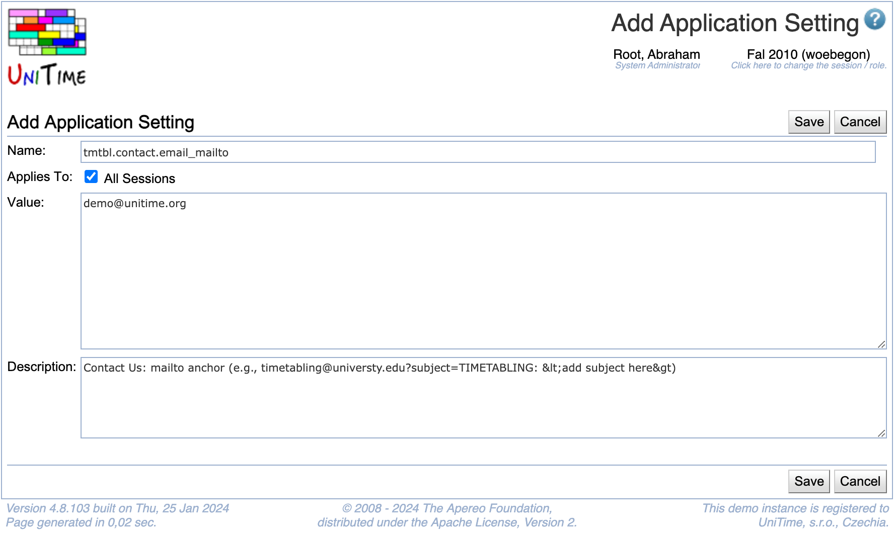

## Screen Description

The Add and Edit Application Setting screens provide interfaces for assigning properties to application setting.

{:class='screenshot'}

## Details

* **Name**
	* Name of the setting recognized by the application
	* Cannot be changed via the edit screen

* **Applies To**
	* Which sessions the setting will affect

* **Value**
	* Current value of the setting (cannot be arbitrary, must be recognized by the application)

* **Description**
	* Description of the setting; can include possible values of the setting

## Operations

* **Update/Save** (Alt+U/Alt+S)
	* Save the changes and go back to the [Application Configuration](application-configuration) screen

* **Delete** (Alt+D)
	* Delete the application setting and go back to the [Application Configuration](application-configuration) screen
	* The setting will continue to exist in the application, but it will not be possible to change its default value

* **Back** (Alt+B)
	* Go back to the [Application Configuration](application-configuration) screen without saving any changes

