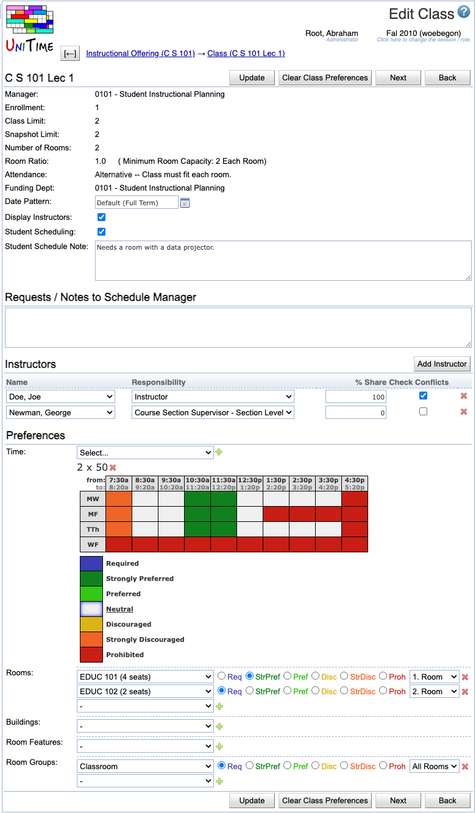

## Screen Description

 In the Class Edit screen, you can change a few properties of the class and enter preferences. The rules explaining how preferences are applied on classes are located in [Application Of Preferences](application-of-preferences). Changes made to this screen are not saved until you click on the Update, Previous, or Next button.

## Details

 The following fields are displayed in the upper part of the screen (below the name of the class):

* **Manager**
	* Manager responsible for timetabling of this class
	* Editable in the [Multiple Class Setup](multiple-class-setup) screen

* **Enrollment**
	* Number of enrolled students (if available)

* **Class Limit**
	* Number of students that should be able to register for a given class
	* Editable in the [Multiple Class Setup](multiple-class-setup) screen

* **Number Of Rooms**
	* Number of rooms that you need for a class (usually one)
	* Editable in the [Multiple Class Setup](multiple-class-setup) screen

* **Room Ratio**
	* The ratio of the required room size to the class limit
		* Room Ratio = Room Size / Class Limit
	* In almost all cases, this is one
	* Some exceptions to the norm
		* You need a room for fewer students than the class limit (Room Ratio is less than one)
		* You need a room for a class with zero limit. In this case, Room Ratio needs to contain the required room size
	* In parenthesis after the room ratio, you can see the minimum room capacity required for this class (for Class Limit <> 0, it is calculated as Minimum Room Capacity = Room Ratio * Class Limit; if Class Limit = 0, then Minimum Room Capacity = Room Ratio)
	* Editable in the [Multiple Class Setup](multiple-class-setup) screen

* **Date Pattern**
	* Days/weeks throughout the semester during which this class will be taught
	* To change the date pattern, select the new date pattern from the drop down list
	* You can click on the icon of the calendar to see which dates belong to the selected date pattern

* **Display Instructors**
	* When checked (and it is checked by default), the instructors for this class will be displayed in the online Schedule of Classes
	* When not checked, the instructors will not be displayed in the online Schedule of Classes, and his/her name will have to be re-entered for reporting purposes

* **Student Scheduling**
	* When checked (and it is checked by default), the class will be avaliable to students during student scheduling
	* When not checked, the class will be treated as with zero limit during student scheduling (only students with individual reservations will be able to get in) - the class not to be displayed is in italics wherever it is listed

* **Student Schedule Note**
	* The class note that will be displayed in the online Schedule of Classes

 In the **Timetable** part, you see the time, room and instructor assigned to this class (once a timetable has been created)

* Normally, a committed timetable is displayed, unless there is a different timetable selected or loaded into the solver for the given class

* If there is a timetable loaded into the solver and a timetable selected, the loaded one is displayed

* See documentation for [Timetables](timetables) page for more details

 The text field in **Requests / Notes to Schedule Manager** is there for Requests/Notes for the manager who will timetable this class.

 In the **Instructors**, the following information is displayed and can be edited

* **Name**
	* Select an instructor's name from the drop down list
	* If a name is missing from this list, you need to add the person to your list through the [Instructors](instructors) screen

* **Share**
	* The percentage of teaching activity for this class associated with this instructor

* **Check Conflicts**
	* When checked, the instructor's preferences are considered during departmental timetabling; also, checks are performed for this instructor to make sure there is no conflict for him/her between this class and his/her other classes (such as teaching two classes at the same time)
	* When not checked, the instructor's assignment to this class is ignored during timetabling; no conflict checking will be performed between this class and his/her other classes

* Operations
	* **Add Instructor** (Alt+I)
		* Add another instructor to the same class
	* **Delete**
		* Remove a given instructor's name from the class

## Preferences

 **Time Preferences**

* If you don't see any time grid, you need to select a time pattern from the drop down list and click **Add Time Preference** (Alt+T)

* You can have more than one possible time pattern for your class - in that case, perform the previous step again to add another time grid

* Indicate the time preferences by filling in the time slots with appropriate colors (click on the colored square in the legend and then on the squares in the time grid that you want to fill in with this preference level)

* Click on the day of week (or combination of days of week) to fill in the grid for the whole day (or combination of days)

* Click on a particular time to fill in the grid for this time (across all the days)

* Click on the upper left hand side corner (which has "from:" and "to:") to fill in the whole time grid

* To delete a time pattern that you do not need, click **Delete** next to the time pattern

* Note: To express that e.g. the class can only be taught on Monday, Wednesday, and Friday, fill in Tuesday and Thursday times as "Prohibited" (as opposed to setting Monday, Wednesday, and Friday as "Required"); this leaves you flexibility to indicate preferred or discouraged times within Monday, Wednesday, and Friday

 **Room Group Preferences**

* Select a room group from the first drop down list and the preference level from the second drop down list

* You can see only those room groups that are applicable to classes of the given manager (for example, for Large Lecture Room classes you can see groups of large lecture rooms); for your departmental classes, you can see only those room groups that are listed in your [Room Groups](room-groups) screen - if you need to add another room group, go to the menu, to Courses → Input Data → [Room Groups](http://help.unitime.org/Room_Groups)

* To add more lines for additional room group preferences, click on **Add Room Group Preference** (Alt+G)

* To delete a line with a room group preference, click on the **Delete** button on that line

* Blank lines are ignored

 **Room Preferences**

* Select a room from the first drop down list and the preference level from the second drop down list

* You can see only those rooms that listed in the [Rooms](rooms) screen for the department managed by the manager listed in your Edit Class screen (look at [Rooms](rooms) to see how to add new rooms to your list of departmental rooms)

* To add more lines for additional room preferences, click on **Add Room Preference** (Alt+R)

* To delete a line with a room preference, click on the **Delete** button on that line

* Blank lines are ignored

 **Building Preferences**

* Select a building from the first drop down list and the preference level from the second drop down list

* You can see only those buildings that are listed in your [Rooms](rooms) screen for the department of this class's manager

* To add more lines for additional building preferences, click on **Add Building Preference** (Alt+D)

* To delete a line with a building preference, click on the **Delete** button on that line

* Blank lines are ignored

 **Room Feature Preferences**

* Select a room feature from the first drop down list and the preference level from the second drop down list

* You can see only those room features that are listed in the [Rooms](rooms) screen

* If you need to add another room feature for your departmental rooms, go to the menu, to Courses → Input Data → [Room Features](room-features)

* To add more lines for additional room feature preferences, click on **Add Room Feature Preference** (Alt+F)

* To delete a line with a room feature preference, click on the **Delete** button on that line

* Blank lines are ignored

## Operations

* **Update** (Alt+U)
	* Save changes and go back to the [Class Detail](class-detail) screen

* **Clear Class Preferences** (Alt+C)
	* Clear all the class preferences in this page and go back to the [Class Detail](class-detail) screen (where you can see that the preferences have been cleared)
	* Preferences will be inherited from the scheduling subpart and/or the instructor

* **Previous** (Alt+P)
	* Save changes and go to the Edit Class screen for the previous class

* **Next** (Alt+N)
	* Save the preferences and go to the Edit Class screen for the next class

* **Back** (Alt+B)
	* Go back to the [Class Detail](class-detail) screen without saving any changes

## Notes

 **Room Groups vs. Room Features**

 The difference between room groups and room features is as follows:

* If you require more than one room group for a given class, it is sufficient if the assigned room belongs to one of them

* If you require more than one room feature, the assigned room has to have all of them

{:class='screenshot'}
