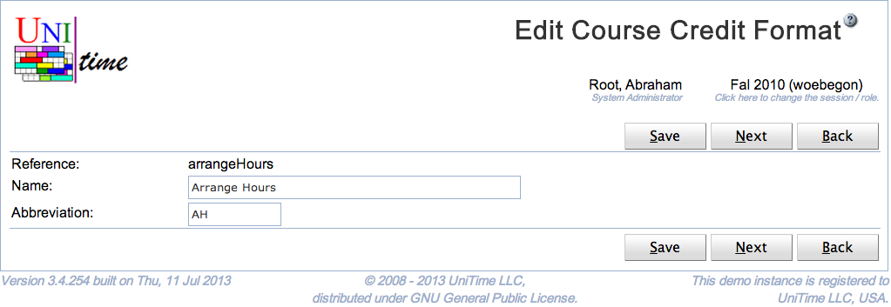

## Screen Description

The Edit Course Credit Format page can be used to change a name and an abbreviation of a credit format. See [Course Credit](course-credit) description for more details.

{:class='screenshot'}

## Details

All credit format names must be unique.

## Operations

Click **Save** to update the modified course credit format. Button **Back** will get you back to [Course Credit Formats](course-credit-formats) page without making any changes.

The buttons **Previous** and **Next** can be used to save the current course credit format and get to the Edit Course Credit Format page for the previous / next format.

