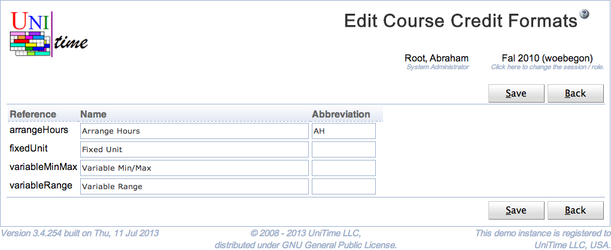

## Screen Description

The Edit Course Credit Formats page can be used to change all credit format names and abbreviations on a single page. See [Course Credit](course-credit) description for more details.

{:class='screenshot'}

## Details

All credit format names must be unique.

## Operations

Click **Save** to save the course credit formats. The button **Back** will get you back to [Course Credit Formats](course-credit-formats) page without making any changes.
