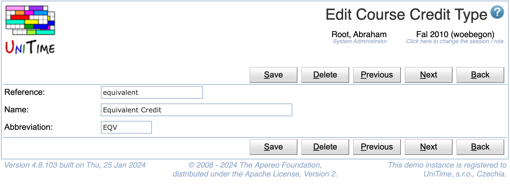

## Screen Description

 The Edit Course Credit Type page can be used to modify an existing credit type. See [Course Credit](course-credit) description for more details.

{:class='screenshot'}

## Details

 Each course credit type has a reference, a name, and an abbreviation. References and names must be unique. Only credit types that are not being used can be deleted.

## Operations

 Click **Save** to update the modified credit type. Button **Back** will get you back to [Course Credit Types](course-credit-types) page without making any changes. Click **Delete** to delete the type.

 The buttons **Previous** and **Next** can be used to save the current type and get to the Edit Course Credit Type page for the previous / next credit type.

