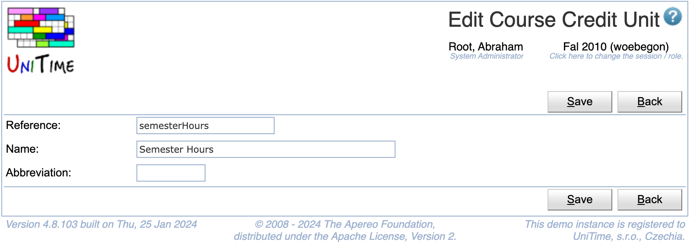

## Screen Description

The Edit Course Credit Unit page can be used to modify an existing credit unit. See [Course Credit](course-credit) description for more details.

{:class='screenshot'}

## Details

Each course credit unit has a reference, a name, and an abbreviation. References and names must be unique. Only credit units that are not being used can be deleted.

## Operations

Click **Save** to update the modified credit unit. Button **Back** will get you back to [Course Credit Units](course-credit-units) page without making any changes. Click **Delete** to delete the unit.

The buttons **Previous** and **Next** can be used to save the current unit and get to the Edit Course Credit Unit page for the previous / next credit unit.

