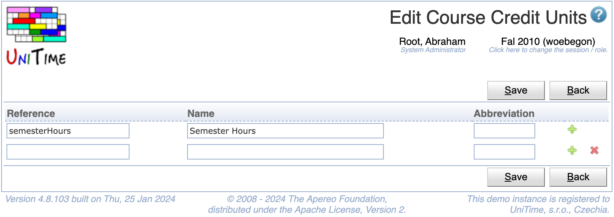

## Screen Description

The Edit Course Credit Units page can be used to create, modify, or delete existing credit units using a single page. See [Course Credit](course-credit) description for more details.

{:class='screenshot'}

## Details

Each course credit unit has a reference, a name, and an abbreviation. References and names must be unique. Only credit units that are not being used can be deleted.

## Operations

Click **Save** to save the credit units. The button **Back** will get you back to [Course Credit Units](course-credit-units) page without making any changes. A new line can be added by clicking on the green plus button, a line (and the appropriate unit) can be deleted by clicking the red x button.

Please note that the credit units that cannot be deleted do not have the red x button.

