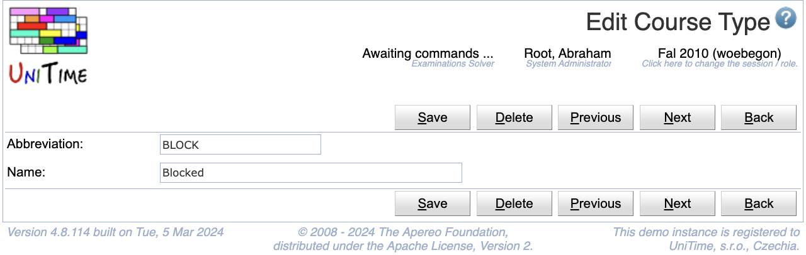

## Screen Description

The Add and Edit Course Type screens can be used to add, change, or delete a course type. Course types can be used to categorize course offerings. The user needs to have Course Type Edit permission to be able to edit course types. See [Course Types](course-types) for more detail.

{:class='screenshot'}

## Details

A course type has an abbreviation and a name defined. Both abbreviations and names have to be unique.

A course type that is being used (i.e., there is a course offering of the type) cannot be deleted.

## Page-specific Properties

The Edit Course Types screen allows the user to edit multiple course types at once. The layout is different, but the properties remain the same.

## Operations

Click **Save** to update the modified type. Button **Back** will get you back to [Course Types](course-types) page without making any changes. Click **Delete** to delete the type.

The buttons **Previous** and **Next** can be used to save the current course type and get to the Edit Course Type page for the previous / next type.

