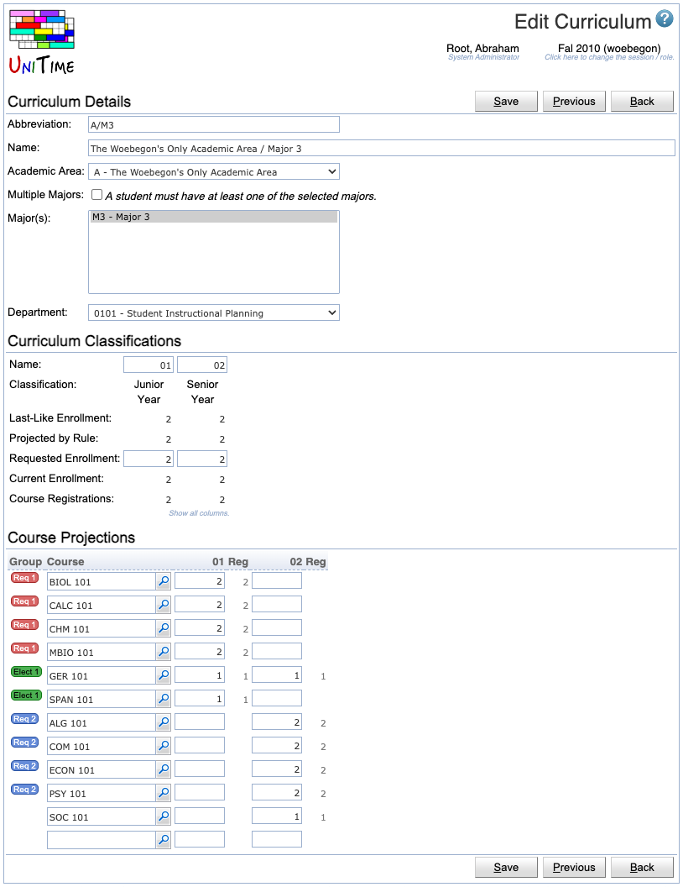

## Screen Description

The Edit Curriculum screen provides interface for editing an existing curriculum.

{:class='screenshot'}

## Details

**Curriculum Details**

* **Abbreviation**
	* Curriculum abbreviation

* **Name**
	* Name of the curriculum

* **Academic Area**
	* Academic area for which the curriculum is set up (each curriculum can only have one academic area)

* **Major(s)**
	* The major (or more majors) within the selected academic area for which the curriculum is set up 

* **Department**
	* The department whose curriculum managers should be able to edit the curriculum

**Curriculum Classifications**

The curriculum classifications show numbers of students in particular semesters of study, including projected numbers or last-like enrollment.

* **Name**
	* Name of the academic classification, i.e., of the semester in which the students will be
		* Examples: 01 - students in their first semester at school, GR - graduate students, ...
	* The default is the abbreviation of the academic classification

* **Classification**
	* Academic classification

* **Last-Like Enrollment**
	* Number of students from given majors who were enrolled in the courses of this curriculum in the last-like semester

* **Projected by Rule**
	* Number of students as projected in the [Curriculum Projection Rules](curriculum-projection-rules) page (calculated and entered by administrators)

* **Requested Enrollment**
	* Expected number of students in the given classification who will follow this curriculum

* **Current Enrollment**
	* Number of students of this curriculum (i.e., who have the majors from this curriculum) currently enrolled in the courses of this curriculum

**Course Projections**

* **Group**
	* The user can define groups of courses that have students in common (such as "1st semester mandatory courses", etc.) or that do not have students in common (such as optional courses for 2nd semester students, out of which each student selects only one course)
	* To create a new group
		1. Click on the lines with the courses that should be included in the group (possibly in the Group column, not on another group's name)
		2. Click on the column header ("Group")
		3. In the menu that opens, click on "New Group"
		4. In the small screen that opens, enter the **Name** (an alphabet letter is suggested as default) and select the **Type**
			* "No conflict (different students)" - for courses that can overlap in time because they do not have students in common
			* "Conflict (same students)" - for courses that have students in common and therefore should not overlap in time
		5. Click on the **Assign** button to assign the group to the courses
	* To add a course to an existing group

	1. Click on the course (possibly in the Group column, not on the name of another group) - the course will become highlighted in blue
	2. Click on the column header ("Group")
	3. In the menu that opens, click on the name of the group you need; now the course should become a part of the group

* To remove a course from a group

	1. Click on the course that should not be included in the group (not on the group icon); the course will become highlighted in blue
	2. Click on the column header ("Group")
	3. In the menu that opens, click on the group that should not include the course any more; the group will be removed from the course

* To delete a group

	1. Click on the group icon in front of any of the courses in the group
	2. In the small screen that opens, click on the **Delete** button

* To sort by group

	1. Click on the "Group" column header
	2. In the menu that opens, click on "Sort by Group"

* **Course**
	* Abbreviations of all the courses in the curriculum
	* Any courses from any subject area can be included in the curriculum (independent of the Academic Area selected for the curriculum)
	* The magnifying glass icon takes the user to the [Course Finder](course-finder) screen which either provides information about the course listed on that line, or, when used for an "empty" course, helps the user find a course by its abbreviation or its long name 
	* After clicking on the column header "Course", the following options appear in a menu

* Select All Courses
	* All courses will be selected/highlighted

* Remove Selected Courses
	* Remove selected courses from the curriculum
	* If a course is removed and then added again, all enrollment request numbers have to be entered again
	* Displayed only when some courses are selected

* Clear Selection
	* Unselect selected courses
	* Displayed only when some courses are selected

* Show Percentages
	* Display percentages of the Requested Enrollment number instead of numbers of students
	* Note: The requested enrollments for each of the courses is stored as percentage of the Requested Enrollment set in the Curriculum Classification section of this screen; when the Requested Enrollment number is changed, the number for each course changes too to reflect the increased/decreased number of students in the curriculum
	* It is not possible to request more than 100% enrollment for a course - if a number higher than 100% is entered, it will automatically be changed to 100%
	* Displayed only when the table shows numbers

* Show Numbers
	* Switch back from percentages to numbers
	* Displayed only when the table shows percentages 

* Show Last-Like Enrollment
	* Show numbers of students from above majors who took the course during the last-like semester

* Show Projection by Rule
	* Show estimated numbers of students derived from projections for majors

* Show Current Enrollment
	* Display the number of students of this curriculum who are enrolled in the course

* Show Empty Courses
	* Display courses with zero students

* Hide Empty Courses
	* Do not display courses with zero students

* Clear Requested Enrollments (All Classifications)
	* Clear all the requested enrollments numbers for all courses in the Course Projections table
	* The Requested Enrollment line in Curriculum Classifications will remain unchanged

* Copy Last-Like → Requested (All Classifications)
	* Use the numbers of last-like students for requested enrollment
	* Displayed only if Last-Like column is shown

* Copy Projection → Requested (All Classifications)
	* Use the projected numbers of students for requested enrollment
	* Displayed only if Projection by Rule column is shown

* Copy Current → Requested (All Classifications)
	* Use the numbers of currently enrolled students for requested enrollment
	* Displayed only if Current Enrollment column is shown

* Sort by Course
	* Sort the Course Projections table by the course abbreviation (alphabetic orde**r)**

* **Academic Classification**
	* For each academic classification, the requested enrollment number can be entered for each course

*  Note: There are two ways of entering the requested enrollment
	1. Number of students (cannot exceed the number from the Requested Enrollment line for the given classification in the Curriculum Classification section of this screen)
	2. Percentage of the total requested enrollment for the given classification (that is, percentage of the number from the Requested Enrollment line for the given classification in the Curriculum Classification section of this screen) - in this case, the "%" sign has to be a part of the entered percentage (example: "25%")

* An academic classification is displayed in the table only if there is a requested enrollment number in the appropriate column in the Curriculum Classification section of this screen

* After clicking on a header of a column related to an academic classification, a menu appears; the first options apply to the whole table and are described above (in the Course header section); the remaining options, applying to a particular column, are as follows

* Clear Requested Enrollments
	* Clear requested enrollments for this academic classification

* Copy Last-Like → Requested
	* Use the numbers of last-like students for requested enrollment
	* Displayed only if Last-Like column is shown

* Copy Projection → Requested
	* Use the projected numbers of students for requested enrollment
	* Displayed only if Projection by Rule column is shown

* Copy Current → Requested
	* Use the numbers of currently enrolled students for requested enrollment
	* Displayed only if Current Enrollment column is shown

* Sort by ...
	* Sort the table by this column, numbers decreasing 

* **Comparison table** on mouse roll-over
	* When one or more courses are selected in the Course Projections table and Current, Last-Like, or Projected numbers of students are displayed, a comparison table appears when the mouse rolls over a course; the table provides information about students (current, last-like, or projected) that the courses have in common
	* The table compares the course on which the mouse is placed with the other courses that have been previously selected (and are highlighted in blue)

## Operations

* **Save** (Alt+S)
	* Save changes made to this curriculum and go back to the [Curriculum Detail](curriculum-detail) screen
	* **Previous** (Alt+P)
		* Save changes and go to the Edit Curriculum screen for the previous curriculum
	* **Next** (Alt+N)
		* Save changes and go to the Edit Curriculum screen for the next curriculum

* **Back** (Alt+B)
	* Go back to the [Curriculum Detail](curriculum-detail) screen without saving any changes

## Notes

**Shortcuts for navigation through the Course Projections table**

* **Windows (Firefox)**
	* Moving a course up or down the list of courses
		* Click on any editable field of a line and press "CTRL+↑" to move the course up the list of courses
		* Click on any editable field of a line and press "CTRL+↓" to move the course down the list of courses
	* Jumping through the editable fields in the table
		* Alt+↑ - move one editable field up
		* Alt+↓ - move one editable field down
		* Alt+→ - move one editable field to the right
		* Alt+← - move one editable field to the left

* **Mac (Chrome, Firefox)**
	* Moving a course up or down the list of courses
		* Click on any editable field of a line and press "control+↑" to move the course up the list of courses
		* Click on any editable field of a line and press "control+↓" to move the course down the list of courses
	* Jumping through the editable fields in the table (it is also possible to use the "command" button instead of "alt")
		* alt+↑ - move one editable field up
		* alt+↓ - move one editable field down
		* alt+→ - move one editable field to the right
		* alt+← - move one editable field to the left

**Exiting pop-up windows**

To exit a pop-up window (such as "Edit group"), just click on any place in the previous screen or press Esc

