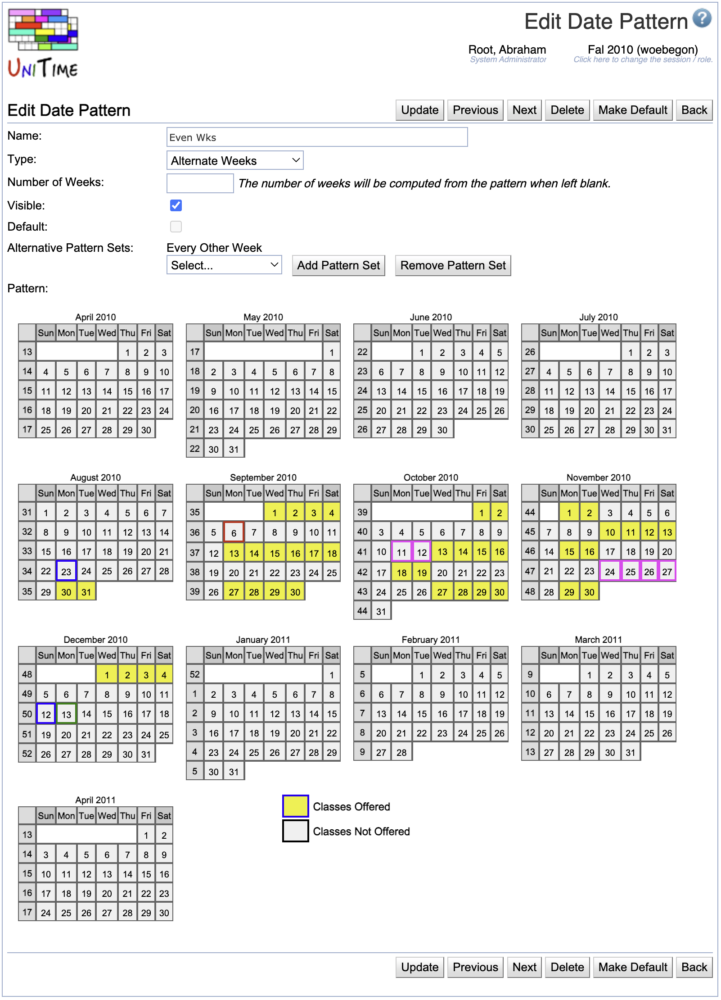

## Screen Description

The Edit Date Pattern screen provides an interface for editing an existing date pattern.

{:class='screenshot'}

A date pattern defines a set of dates associated with a term when a class may meet. The actual meeting times of a class are computed as a projection of a time pattern onto a date pattern (e.g., a class that is taught on Tuesdays and Thursdays meets on all dates from the date pattern that are on Tuesday and Thursday). Normally, a date pattern should contain all dates of particular weeks (e.g, Week 1-4 contains all dates between Monday of the first week and Sunday of the 4th week). Date patterns consist of dates rather than weeks in order to allow institutions to shift weeks around holidays.

## Details

* **Name**
	* Name of the date pattern

* **Type**
	* Type of the date pattern (**Standard**, **Alternate Weeks**, **Non-Standard**, **Extended**)
	* These types may be helpful for organizing the list of date patterns
		* On classes and scheduling subparts, date patterns are ordered based on these types (Standard date patterns first, then Alternate Weeks, etc.)
	* If the type is **Extended**, only explicitly indicated departments (and administrators) have access to this date pattern (these are not visible as options on classes and scheduling subparts that are managed by departments not listed on these date patterns)
	* **Alternative Pattern Set** type can be used to define alternative date patterns (e.g. every other week)
		* In this case there is no pattern, but a list of date patterns the solver can choose from is selected (e.g. even weeks, odd weeks)

* **Number of Weeks**
	* Number of weeks of the date pattern for reporting purposes
	* The number of weeks will be computed from the pattern when left blank

* **Visible**
	* When checked (checked by default), the date pattern will be available to users authorized to use it
	* When not checked, the date pattern will not be available for the given academic session and will be displayed in gray letters in the list of date patterns; if the date pattern was used before it was made invisible, it will stay on a class but it will no longer be an option to pick on other classes

* **Default**
	* Checked if this date pattern is the default date pattern for all classes
	* The default date pattern is displayed in bold letters in the list of date patterns
	* To change the default date pattern, go to the add/edit screen of the date pattern that should be default and click on the **Make Default** button (alternatively, you can select a default date pattern on [Edit Academic Session](edit-academic-session) screen)

* **Departments**
	* This item is only accessible when either the **Extended** or the **Alternative Pattern Set** type is selected
	* For the date patterns of type **Extended**, it is necessary to specify which departments should have access to the date pattern (unless the date pattern should be used by administrator only)
	* Select a department in the drop-down menu and click **Add Department** to authorize the department to use the date pattern (not applied until Save is clicked)
	* Select a department in the drop-down menu and click **Remove Department** to withhold the authorization to use a given date pattern by that department

* **Date Patterns**
	* This item is only available when the **Alternative Pattern Set** type is selected
	* List of date patterns that are alternative to each other (can be used when the alternative pattern set date pattern is set for a class)
	* Select a date pattern in the drop-down menu and click **Add Date Pattern** to add it on the list
	* Select a date pattern in the drop-down menu and click **Remove Date Pattern** to remove it from the list

* **Alternative Pattern Sets**
	* This item is only available when the type is not the **Alternative Pattern Set** type, and there is at least one alternative date pattern set already created
	* List of alternative pattern sets that this date pattern belongs to
	* Select a date pattern in the drop-down menu and click **Add Date Pattern** to add it on the list
	* Select a date pattern in the drop-down menu and click **Remove Date Pattern** to remove it from the list

* **Pattern**
	* Indicate days of instructions in the calendar
	* Not available when the **Alternative Pattern Set** type is selected

## Operations

* **Update**
	* Save changes and go back to the [Date Patterns](date-patterns) screen

* **Delete**
	* Delete the date pattern and go back to the [Date Patterns](date-patterns) screen
	* It is possible to delete a date pattern only if it is not used on any class
	* If it is used somewhere, you can make the date pattern not visible, so that it cannot be assigned to any other class anymore

* **Make Default**
	* Save changes, make the date pattern the default date pattern and go back to the [Date Patterns](date-patterns) screen

* **Back**
	* Go back to the [Date Patterns](date-patterns) screen without saving any changes

