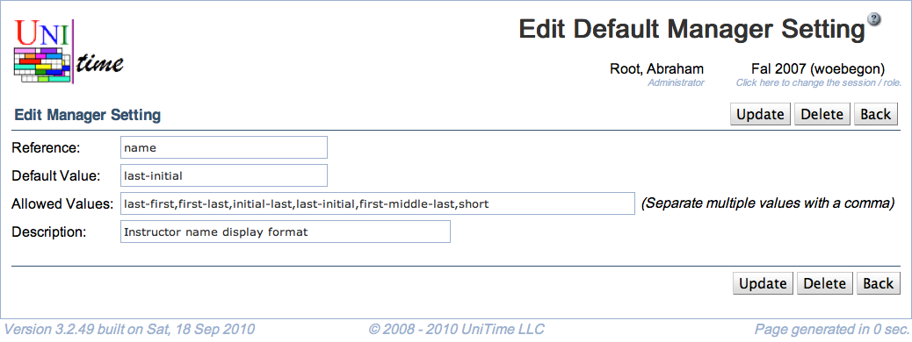

## Screen Description

The Edit Default Manager Setting screen provides interface for editing an existing manager setting and setting its default value.

{:class='screenshot'}

**Note:** Some changes should be implemented and recognized by the application before they are made here.

## Details

* **Reference**
	* The name by which the application recognizes the setting

* **Description**
	* The description that is displayed in the [Manager Settings](manager-settings) screen (accessible by all schedule managers)

* **Default Value**
	* Value applicable to all schedule managers unless it is changed by them in the [Manager Settings](manager-settings) screen

* **Allowed Values**
	* List of possible values of the setting from which the schedule managers can choose in the [Edit Manager Setting](edit-manager-setting) screen

## Operations

* **Save** (Alt+S)
	* Save changes and go back to the [Default Manager Settings](default-manager-settings) screen

* **Delete** (Alt+D)
	* Delete this setting (= make it impossible for schedule managers to use other than the application's default value) and go back to the [Default Manager Settings](default-manager-settings) screen

* **Previous** (Alt+P)
	* Save changes and go to the previous Default Manager Setting

* **Next** (Alt+N)
	* Save changes and go to the next Default Manager Setting

* **Back** (Alt+B)
	* Go back to the [Default Manager Settings](default-manager-settings) screen without saving any changes
