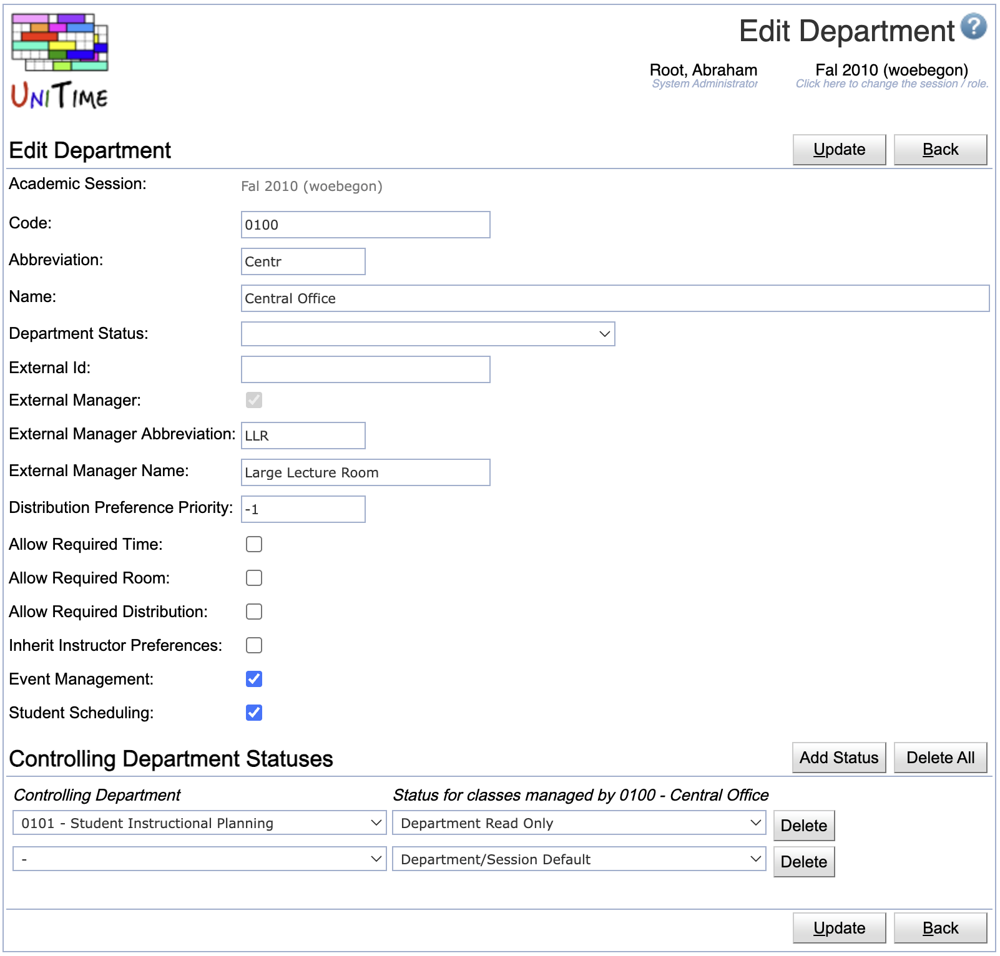

## Screen Description

Edit an existing department in the Edit Department screen.

{:class='screenshot'}

## Details

* **Academic Session**
	* The academic session for which you are editing the department
	* Can be changed in the [Academic Sessions](academic-sessions) screen

* **Number / Code**
	* Departmental identifier
	* Used in imports/exports (corresponds to the "department" element in the XML staff file)

* **Abbreviation**
	* Departmental abbreviation

* **Name**
	* Name of the department

* **Departmental Status**
	* Current status of the department
	* Options (set up in the [Status Types](status-types) screen)
		* Session Default - the default status of the academic session (the default session is set up from the [Academic Sessions](academic-sessions) screen)
		* External Manager Input Data Entry - this status is only applicable to departments that are marked as external manager; the departmental schedule managers can not edit classes belonging to this externally managed department (nor see preferences of these classes) and also cannot change ownership of these classes or make another classes externally managed by this department; external managers (users associated with this department) can edit classes that are externally managed by this department
		* External Manager Timetabling - this status is only applicable to departments that are marked as external manager; schedule managers can only change instructor assignments on classes that are externally managed by this department (using screen [Assign Instructors](assign-instructors), they also cannot see preferences of these classes), external managers can edit classes and commit/uncommit a timetable
		* External Manager Timetabling (No Instructor Timetabling) - same as above, except that the departmental schedule deputies cannot edit instructor assignments for externally managed classes
		* External Manager Timetable Published - this status is only applicable to departments that are marked as external manager; time/room assignments published (a timetable is committed), neither schedule managers nor external managers can edit anything any more
		* Department Read Only - this status is only applicable to departments that are NOT marked as external manager; only the administrator can edit departmental data
		* Department Allow Edit - this status is only applicable to departments that are NOT marked as external manager; when session default is departmental read only, an individual department can be allowed to continue editing and timetabling of their departmental classes (i.e., classes that are not externally managed)

* **External ID**
	* External ID of the department (this ID can be used for synchronization of department data with outside systems). It is not related to external managers.

* **External Manager**
	* Checked if the department manages classes from other departments (classes associated with this department will be 'externally' managed, i.e., this department does not have subject areas of its own and serves to timetable a subset of classes from other departments/subject areas that should be considered together (e.g., due to shared resources), for example, classes in large lecture rooms or computing labs).
	* A class can be managed either by its own department (i.e., the department that is associated with the subject area of the class), or by one of the departments that are marked as external manager. This ownership of a class (or a set of classes) can be changed on pages [Instructional Offering Configuration](instructional-offering-configuration), [Multiple Class Setup](multiple-class-setup)).
		* A department can be made externally managed, only if it does not have any subject areas associated with it.
		* An externally managed department can be changed back to not-externally managed department, if there is no class that is being managed by the department (i.e., there is no class with ownership changed to this department).

* **External Manager Abbreviation**
	* Fill in if this department is externally managed

* **External Manager Name**
	* Fill in if this department is externally managed

* **Distribution Preference Priority**
	* A distribution preference set up between different departments is applied to the department with the highest number
	* This priority should correspond with the order in which departments (classes that are managed by these departments) are being timetabled (e.g., large rooms first, then all departmental problems, then computing labs)

* **Allow Required Time**
	* Option for an externally managed department
	* Check if the departmental schedule deputies should be allowed to enter required times (by default, they cannot use required/prohibited for time preferences)

* **Allow Required Room**
	* Option for an externally managed department
	* Check if the departmental schedule deputies should be allowed to enter required rooms (by default, they cannot use required/prohibited for room preferences)

* **Allow Required Distribution**
	* Option for an externally managed department
	* Check if the departmental schedule deputies should be allowed to enter required distribution preferences (by default, they cannot use required/prohibited for distribution preferences)

* **Inherit Instructor Preferences**
	* Check if instructor preferences should be automatically carried over to classes

* **Event Management**
	* Check if event management is enabled for this department

* **Student Scheduling**
	* Check if courses of this department should be included in student scheduling

* **External Funding Department**
	* Check if this department can be used as an external funding department for classes
		* This field is not visible by default. To enable this field the `unitime.courses.funding_departments_enabled` application property must be set to `true`.

## Operations

* **Update/Save** (ALT+U/ALT+S
	* Save changes and go back to the [Departments](departments) screen

* **Delete** (Alt+D)
	* Delete department and go back to the [Departments](departments) screen
	* This operation is only available when it is allowed to delete a department
		* A department cannot be deleted if it has a solver group or if there is a course offered in one of its subject areas.

* **Back** (ALT+B)
	* Go back to the [Departments](departments) screen without saving changes

