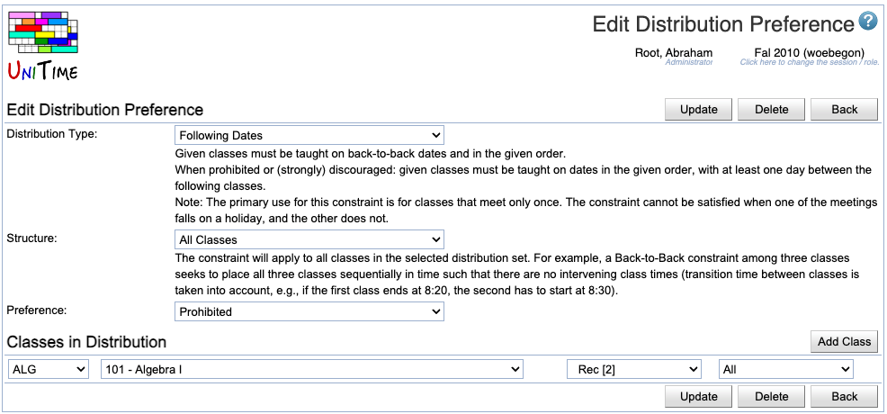

## Screen Description

 The Edit Distribution Preference screen provides interface for editing existing distribution preferences.

## Details

* **Distribution Type**
	* Type of the distribution preference (such as Back-To-Back)
	* When you select the type, its description appears right under the drop down list
	* You can see a complete list of types in [Types of Distribution Preferences](types-of-distribution-preferences)

* **Structure**
	* Structure of the preference (such as Groups of Two)
	* When you select the structure, its description appears right under the drop down list
	* You can see a complete list of possible structures in [Structure of Distribution Preferences](structure-of-distribution-preferences)

* **Preference**
	* Preference level for this distribution preference

* **Classes in Distribution**
	* Click on the **Add Class** (Alt+C) button to add a line with drop down lists (as many times as you need)
		* The drop down lists are populated based on the previous column; the columns are:
			* Subject Area
			* Course Number
			* Scheduling Subpart
			* Class Number (or All, if the preference should be applied to the whole scheduling subpart)

* The **up** and **down** arrows can be used to change the order of classes if order is important (for example, when the Distribution Type "Precedence" is used).

* You can delete any of the lines with classes by clicking on the **Delete** button at the end of the line.

## Operations

* **Update** (Alt+U)
	* Save changes to the distribution preference and go back to the previous screen

* **Delete** (Alt+D)
	* Delete the distribution preference and go back to the previous screen

* **Back** (Alt+B)
	* Go back to the previous screen without saving changes

{:class='screenshot'}
