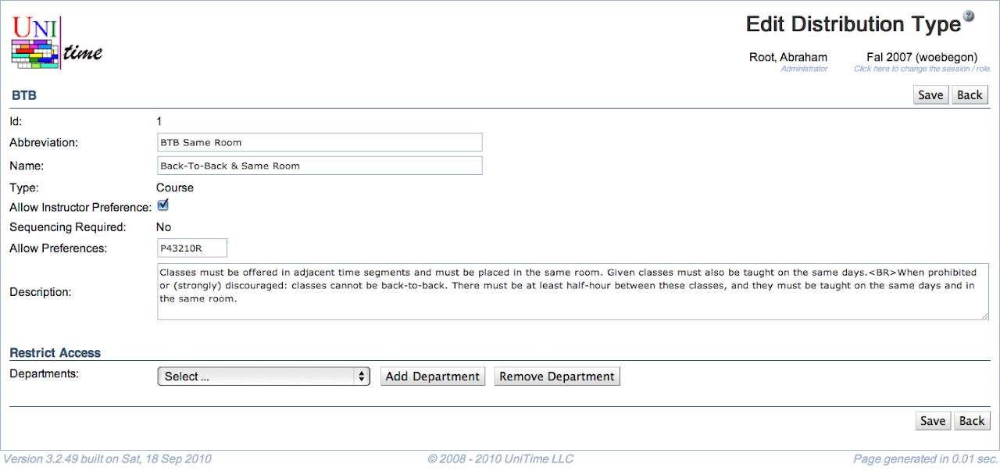

## Screen Description

In the Edit Distribution Type screen you can edit the information displayed about a type of a distribution preference and limit access to that preference to certain departments. You cannot redefine what a distribution preference does.

{:class='screenshot'}

## Details

### Type

The "reference" of the distribution type is listed on the top line (it is the name of the type recognized by solver, cannot be edited in the timetabling application)

* **ID**
	* ID of the distribution type

* **Abbreviation**
	* Abbreviation of the distribution type (listed e.g. in the drop down list in the [Distribution Preferences](distribution-preferences) screen or in [Instructional Offerings](instructional-offerings))

* **Name**
	* Name of the distribution type

* **Allow Instructor Preference**
	* When checked, this distribution type can be used for setting up distribution preferences for an instructor in the [Instructor Preferences](instructor-preferences) screen

* **Sequencing Required**
	* This item is not editable through the user interface; the values are
		* Yes - the order of classes in the distribution preference with this distribution type matters (for example, for the type Precedence)
		* No - the order of classes does not matter (for example, for the type Same Room)

* **Allow Preferences**
	* The level of preferences that should be allowed for this distribution type
	* P = prohibited, 4 = strongly discouraged, ... , R = required

* **Description**
	* Description of the distribution type as displayed in the [Distribution Preferences](distribution-preferences) screen

### Restrict Access

* **Departments**
	* If no department is listed, all departments can use this distribution type
	* Select a department from the drop down list and click **Add Department** to indicate to which department the access should be restricted (more than one department can be added)
	* Select a department from the drop down list and click **Remove Department** to remove a department from the list of departments with restricted access

## Operations

* **Save**
	* Save changes and go back to the [Distribution Types](distribution-types) screen

* **Back**
	* Go back to the [Distribution Types](distribution-types) screen without saving any changes

