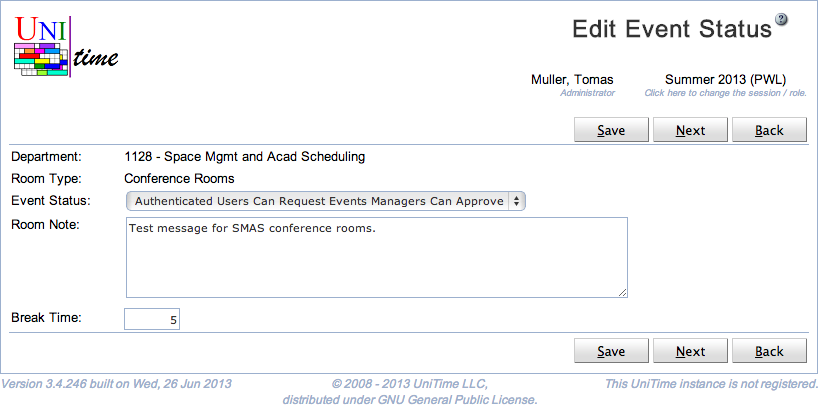

## Screen Description

The Edit Event Status screen provides interface for changing the status for a given department and a given event room type or room. It is also possible to set up a default room note that appears for events in the corresponding rooms and the break time.

{:class='screenshot'}

## Details

When a line with a room type is clicked in the [Event Statuses](event-statuses) screen, the first two lines are

* **Department**
	* The event department for which the status/message/break time should be set
	* Displayed when a line with room type is clicked in the [Event Statuses](event-statuses) screen

* **Room Type**
	* The event room type for which the status, room note, and break time should be set

When a line with a particular room is clicked in the [Event Statuses](event-statuses) screen, the first two lines are

* **Type**
	* The event department and the type of this room

* **Room**
	* The room for which the status, room note, and break time should be set

The remaining items are

* **Event Status**
	* The status of this department and room or rooms of this room type for event management

* **Room Note**
	* Event room note that is the default note for this room or rooms of this type and this department when a new event (or meeting) is being created

* **Break Time**
	* Number of minutes indicating how long the room should be blocked for this event after the official end of the event; it is similar to the break time after classes
		* For course related events that require the students to attend, the students are also blocked during the break time and e.g. if examinations are to be timetabled, there would be a conflict if the break time overlapped with an examination

## Operations

* **Save**
	* Save changes and go back to the [Event Statuses](event-statuses) screen

* **Previous**
	* Save changes and go to the Edit Event Status screen for the previous department and room or room type

* **Next**
	* Save changes and go to the Edit Event Status screen for the next department and room or room type

* **Back**
	* Go back to the [Event Statuses](event-statuses) screen without saving any changes

