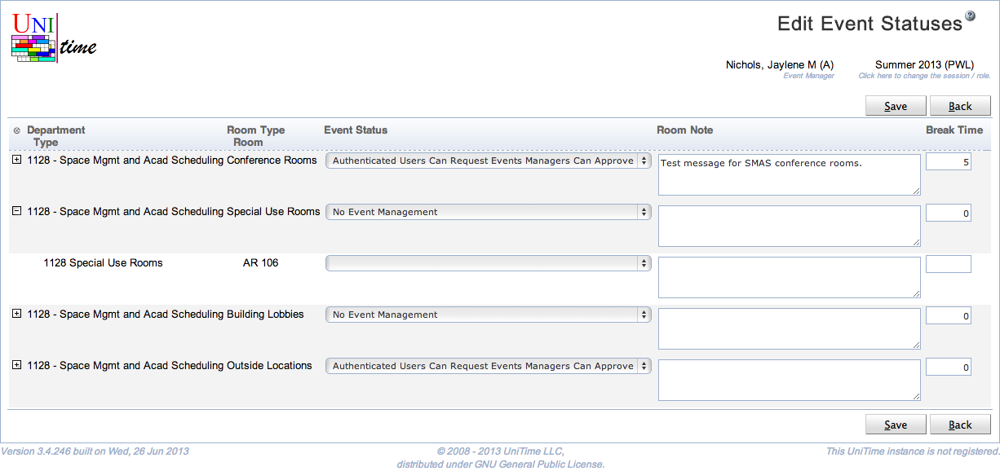

## Screen Description

The Edit Event Statuses screen makes it possible to edit all the lines from the [Event Statuses](event-statuses) screen at once (in one screen).

{:class='screenshot'}

## Details

The information and the editable fields are the same as in the [Edit Event Status](edit-event-status) screen.

## Operations

* **Save**
	* Save changes and go back to the [Event Statuses](event-statuses) screen

* **Back**
	* Go back to the [Event Statuses](event-statuses) screen without saving any changes

