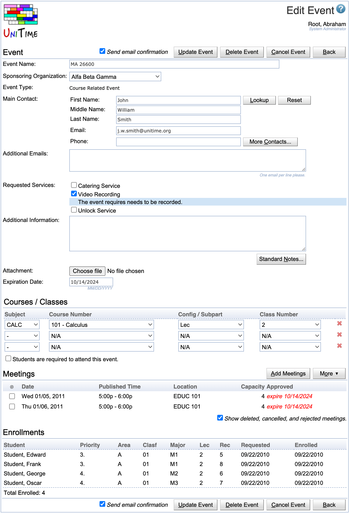
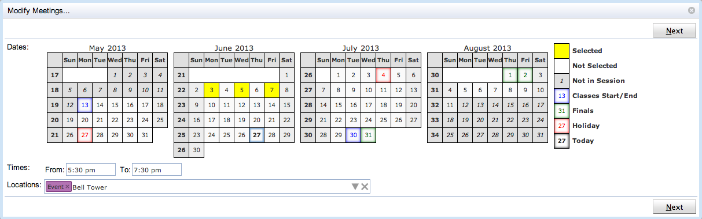
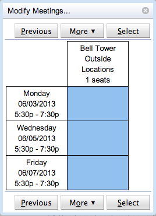
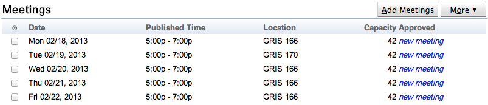
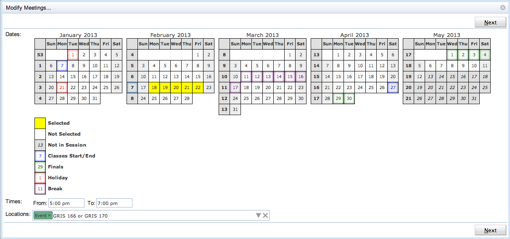
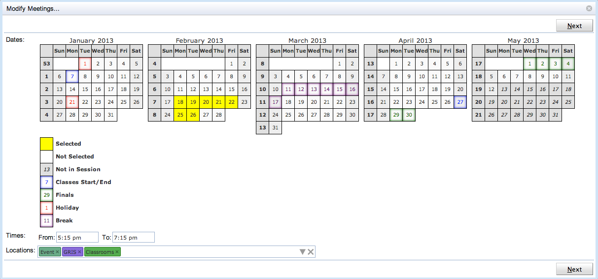
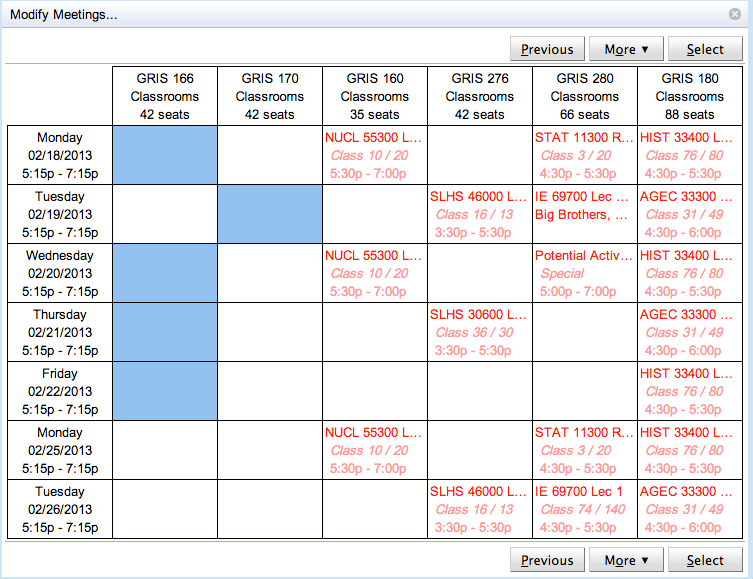
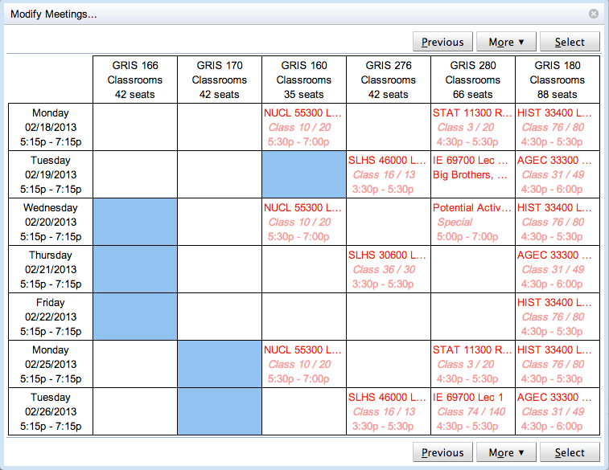
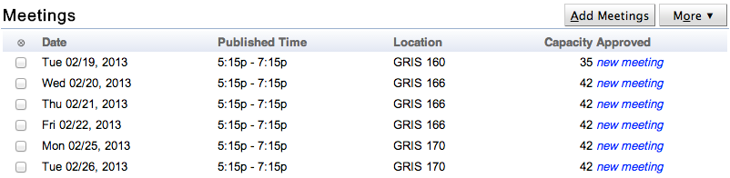

## Screen Description

 The Edit Event screen provides interface for changing an existing event. This includes changing its properties (name, sponsoring organization, contacts, etc.) as well as adding new meetings, deleting / canceling, or modifying existing meetings.

 Changes to the event are only made after the **Update Event** button is clicked. If all meetings can be cancelled or deleted, it is also possible to cancel or delete all meetings of the event by clicking the **Cancel Event** or **Delete Event** button. **Back** button will return on the [Event Detail](event-detail) page of the event.

 Most of the page works the same as the [Add Event](add-event) page, however, it is not possible to change type or an academic session of an existing event.

## Meetings

 One or more meetings can be added for the event by clicking the **Add Meetings** button. See the description of [Add Event](add-event) page for more details. Existing meetings can be also deleted (when allowed and if they have not been approved yet) or cancelled (if allowed). To do so, select the appropriate meeting and choose **Delete** option or **Cancel** option under the **More** button.

 It is also possible to modify one or more meetings. To do so, select meetings that need to be modified (note that all the meeting in the selection have to have the same time) and click on **Modify...** option under the **More** button. One meeting can be also modified by clicking on the meeting directly. The following dialog will appear:

{:class='screenshot'}

{:class='screenshot'}

 The dialog is the same as the Add Meetings... dialog (described in great detail in the documentation of the [Add Event](add-event) page), however, the selection is pre-populated with the meetings that are to be modified. You can see that the selected dates, time, and locations correspond to the dates of the selected meetings. Also, if nothing is changed, the next page contains the selection that corresponds to the meetings that are being modified.

{:class='screenshot'}

 Once the **Select** button is clicked, all the changes made in the Modify Meetings... dialog are reflected to the selected meetings. Meetings that corresponds to the blue boxes that were unselected on the second page will get deleted (if possible) or cancelled (otherwise). New meetings will be added. If the time was changed, all the selected meetings will get deleted (if possible) or cancelled (otherwise) and a new set of meetings will be added as it is generally not allowed to change date, time, or room of an existing meeting.

## Modify Meetings Example

 1) For instance, lets start from the following set of meetings. Please note that the second meeting is in a different room than the others.

{:class='screenshot'}

 2) When More > Modify ... is clicked, the appropriate dates, time, and locations are filled in:

{:class='screenshot'}

 3) If you Next is clicked, you can see that the correct meetings are selected. Clicking on Select button would not change anything, the same 5 meetings will be in the list of meetings.

{:class='screenshot'}

 4) Lets make some changes... Note that there have been added two more days, the time was shifted by 15 minutes, and the room filter was broaden a bit.

{:class='screenshot'}

 5) Now, on the next page, you can see that the original meetings are still there... Clicking on the Select button would only shift all of them by 15 minutes, regardless the differences in dates and rooms on the previous page of the dialog.

{:class='screenshot'}

 6) Lets move some meetings... The first meeting was removed, the second meeting was moved to a different room, and two more meetings were added during the next week.

{:class='screenshot'}

 7) This is the output (after Select button is clicked).

{:class='screenshot'}
