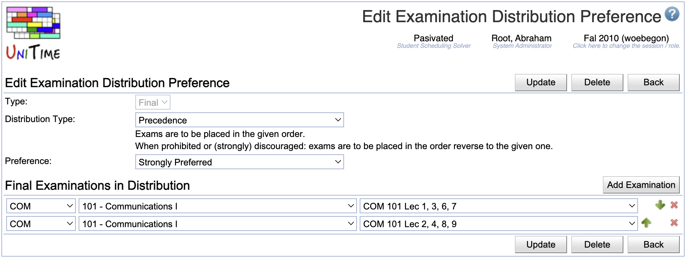

## Screen Description

 The Edit Examination Distribution Preference screen provides user interface for editing an existing distribution preference between midterm or final examinations.

## Details

### Edit Examination Distribution Preference

* **Distribution Type**
	* Type of the distribution preference
	* When a type is selected, its description is displayed right below the drop down list
	* Possible types
		* Precedence
			* Exams are to be placed in the given order.
			* When prohibited or (strongly) discouraged: exams are to be placed in the order reverse to the given one.
		* Same Period
			* Exams are to be placed at the same period.
			* When prohibited or (strongly) discouraged: exams are to be placed at different periods.
		* Same Room
			* Exams are to be placed at the same room(s).
			* When prohibited or (strongly) discouraged: exams are to be placed at different rooms.

* **Preference**
	* Preference level - a scale ranging from prohibited to required

### Midterm/Final Examinations in Distribution

* Operation: **Add Examination**
	* Add another line with drop down lists in which you can select another examination

* The three drop down lists on each line are for

	1. Subject area
	2. Course number
	3. Examination name

* Click **Delete** to delete a line with a given examination

## Operations

* **Update** (ALT+U)
	* Save changes and go back to the previous screen

* **Delete** (ALT+D)
	* Delete the distribution preference and go back to the previous screen

* **Back** (ALT+B)
	* Go back to the previous screen without saving any changes

{:class='screenshot'}
