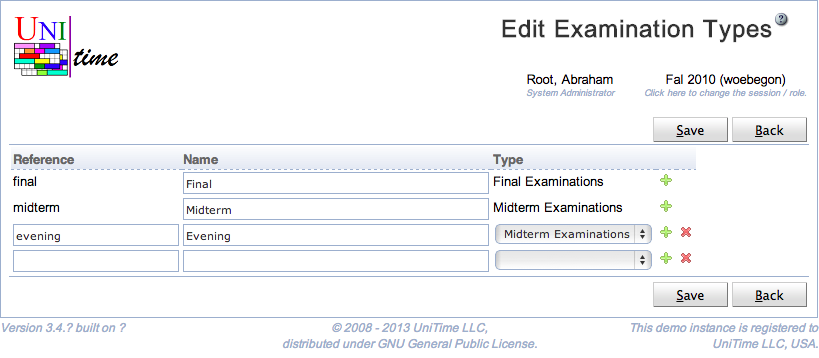

## Screen Description

The Edit Examination Types page can be used to create, modify, or delete existing examination types using a single page. Examination types can be used to define multiple examination problems in an academic session. For instance, there can be multiple final examination problems defined, each timetabled separately. See [Examination Types](examination-types) page for more detail. Permission Examination Type Edit is needed to make changes to examination types.

{:class='screenshot'}

## Details

Examination type has an abbreviation and a name. Both abbreviations and names must be provided and unique. An examination type also needs to be either of Final or of Midterm type. This type drives how the examination period preferences are displayed, whether there will be midterm or final examination events created, and they are used in the status types.

Only examination types that are not being used (i.e., there is no examination period of the type created) can be deleted. For historic reasons, there always have to be one final examination type and one midterm examination type. Examination types that are being used cannot have the type changed as well.

## Operations

Click **Save** to save the examination types. The button **Back** will get you back to [Examination Types](examination-types) page without making any changes. A new line can be added by clicking on the green plus button, a line (and the appropriate examination type) can be deleted by clicking the red x button.

Please note that the types that cannot be deleted do not have the red x button.
