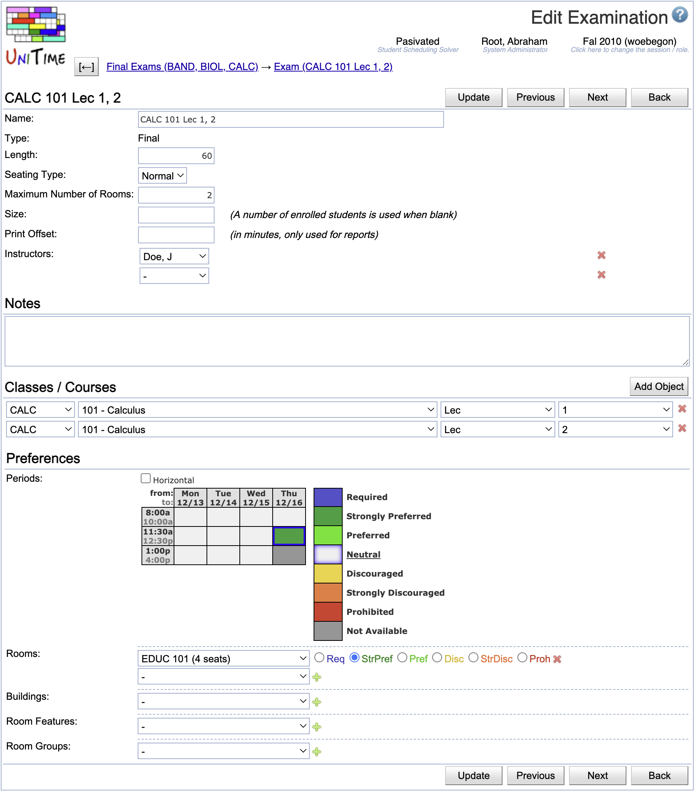

## Screen Description

The Edit Examination screen provides interface for editing an existing midterm or final examination.

{:class='screenshot'}

## Details

### Examination

* **Name**
	* Name of the examination
	* Can be left blank (in that case, a default name is generated from the classes/courses specified in this screen)

* **Type**
	* Type of the examination
	* Midterm or Final

* **Length**
	* Length of the examination in minutes

* **Seating Type**
	* Exam or Normal seating type
	* An examination needs to be assigned to one or more rooms of enough capacity. Based on this seating type, either room capacity (Normal type) or room examination capacity (Exam type) must be met. These capacities are displayed for each room in the [Rooms](rooms) screen.

* **Maximum Number of Rooms**
	* The maximum number of rooms into which an examination can be split (for example, an examination for a class of 400 students can be split into two or three rooms if they need to use Exam seating type and do not have a room with exam seating capacity of 400 seats)
	* An exam is not assigned to a room when the maximum number of rooms is set to zero (it is assigned to a period that best meets the student needs and period preferences).

* **Notes**
	* Notes from the schedule deputies for the examination manager

* **Instructors**
	* Select instructors who should be associated with the examination
	* Click the **Add Instructor** button if you need more lines to select more instructors
	* Note: If the drop down list is empty and you are an examination manager, select some classes/courses first and refresh the screen (for example by clicking the Add Object button) - the list will be populated by instructors of the classes/courses departments

### Classes/Courses

This section provides information about the instructional offering components (classes, instructional offering configurations, course offerings, and instructional offerings) whose students need to take this examination. These components define what students are to be attending the examination (i.e., students that are enrolled into the classes/courses/etc. displayed in this section).

The column names are self-explanatory.

* To add more lines for additional instructional offering components, click on **Add Object** (ALT+O)

* To delete a line with an instructional offering component, click on the **Delete** button on that line

* Blank lines are ignored

### Examination Period Preferences

Time grids are displayed based on the examination type. For Midterm Examinations, the available time periods are all at first marked as Prohibited; the user needs to select a different preference level for the time periods that can be used.

Select the preference level in the colored squares in the legend and then click on the examination time periods that should have that preference.

### Room Group Preference

* Select a room group from the first drop down list and the preference level from the second drop down list

* You can only see room groups related to midterm/final examination rooms

* To add more lines for additional room group preferences, click on **Add Room Group Preference** (ALT+G)

* To delete a line with a room group preference, click on the **Delete** button on that line

* Blank lines are ignored

### Room Preferences

* Select a room from the first drop down list and the preference level from the second drop down list

* You can see only those rooms that listed in the [Rooms](rooms) screen for midterm/final examinations (look at [Rooms](rooms) to see how to add new rooms to your list of examination rooms)

* To add more lines for additional room preferences, click on **Add Room Preference** (ALT+R)

* To delete a line with a room preference, click on the **Delete** button on that line

* Blank lines are ignored

### Building Preferences

* Select a building from the first drop down list and the preference level from the second drop down list

* You can see only those buildings that are listed in your [Rooms](rooms) screen for midterm/final examinations

* To add more lines for additional building preferences, click on **Add Building Preference** (ALT+D)

* To delete a line with a building preference, click on the **Delete** button on that line

* Blank lines are ignored

### Room Feature Preferences

* Select a room feature from the first drop down list and the preference level from the second drop down list

* You can see only those room features that are listed in the [Rooms](rooms) screen

* If you need to add another room feature for the examination rooms, click on "Features" in the left hand side menu and then on the "Add New Room Feature" button

* To add more lines for additional room feature preferences, click on **Add Room Feature Preference** (ALT+F)

* To delete a line with a room feature preference, click on the **Delete** button on that line

* Blank lines are ignored

## Operations

* **Update** (Alt+U)
	* Save changes and go back to the previous screen

* **Previous** (Alt+P)
	* Save changes and go to the Edit Examination screen for the previous examination

* **Next** (Alt+N)
	* Save changes and go to the Edit Examination screen for the next examination

* **Back** (Alt+B)
	* Go back to the previous screen without saving any changes
