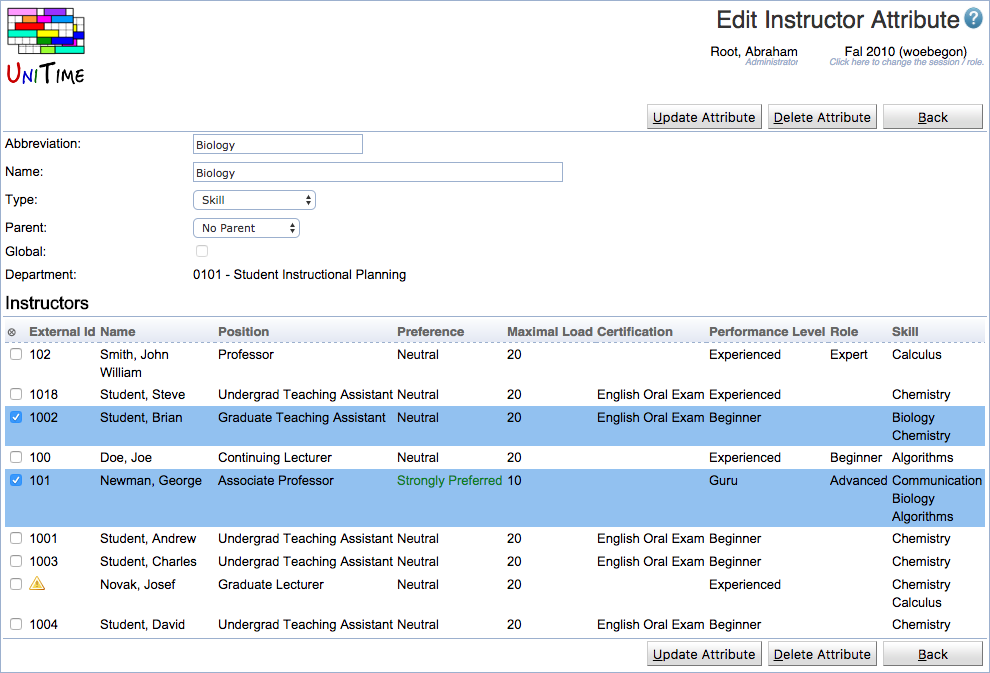

## Screen Description

The Edit Instructor Attribute page can be used to edit an existing instructor attribute and/or assign it to instructors of the selected department. An instructor attribute can be either global (for all departments of the academic session) or departmental (only related to a particular department).

{:class='screenshot'}

Instructor attribute types need to be defined first, see Administration > Other > [Instructor Attribute Types](instructor-attribute-types) for more details. Permission Instructor Attribute Edit is needed to change an existing department instructor attribute and Instructor Global Attribute Edit is needed to change a global instructor attribute. Permission Instructor Attribute Assign is needed to assign an instructor attribute to instructors of a department. Permission Instructor Attribute Delete is needed to delete an instructor attribute.

## Details

Each attribute has an abbreviation, name, type (see [Instructor Attribute Types](instructor-attribute-types)), and it can be associated with a list of instructors. An instructor can have multiple attributes of the same type. It is also possible to define a parent of an attribute. This is useful if there is a hierarchy, e.g., an experienced instructor can teach advanced courses, but he/she can also teach beginner classes. In other words, if a particular attribute is preferred or required, instructors with the same attribute or with one of the parent attributes (attribute parent of the selected attribute, or the parent of the parent attribute, etc.) meet the preference or requirements.

## Operations

Click **Update Attribute** button to update the attribute. Click **Delete Attribute** to delete the attribute. Click **Back** to go back to [Instructor Attributes](instructor-attributes) page without making any changes.
