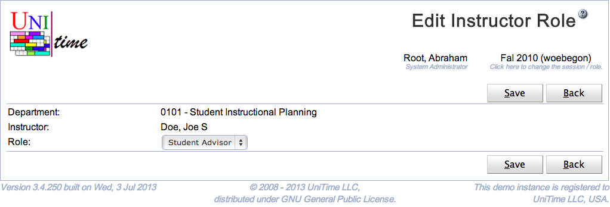

## Screen Description

The Add and Edit Instructor Role pages can be used to assign a role to an instructor. The user needs to have the Instructor Role Edit permission to be able to set instructor roles. See [Instructor Roles](instructor-roles) page for more detail.

{:class='screenshot'}

## Details

Only roles with the Instructor toggle checked are listed in the Role drop down. See [Roles](roles) for more detail.

## Operations

Click **Save** to assign the role to the instructor. Button **Back** will get you back to [Instructor Roles](instructor-roles) page without making any changes. Click **Delete** to delete the role from the instructor.

The buttons **Previous** and **Next** can be used to save the current role and get to the Edit Instructor Role page for the previous / next instructor.

