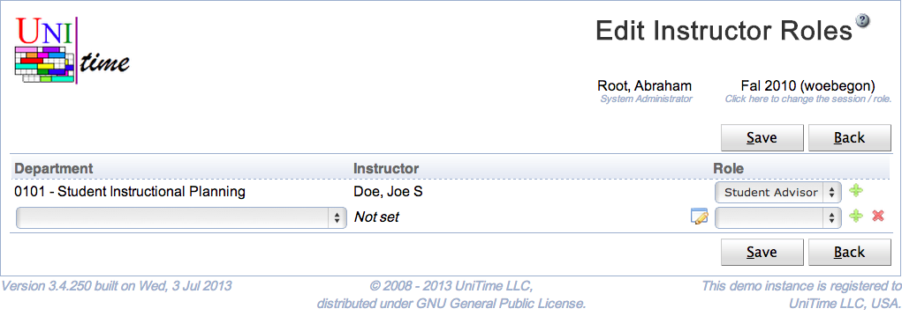
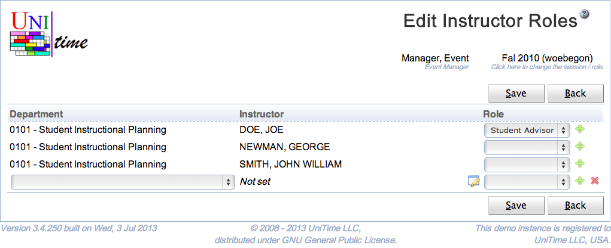

## Screen Description

The Edit Instructor Roles page can be used to assign instructors (and other departmental personell) with roles using a single page. The user needs to have Instructor Role Edit permission to be able to set instructor roles. See [Instructor Roles](instructor-roles) page for more details.

{:class='screenshot'}

## Details

Each instructor of a department can be given a role. If a new person is looked up, an appropriate instructor is also created on the [Instructors](instructors) page. Administrative uses do only see instructors which already have a role given on this page. Users of department dependent roles (e.g., an event manager or a schedule manager) can see all instructors of their department(s). See the second screen shot.

{:class='screenshot'}

If the page is used by a user with a departmental role (e.g., an event manager or a schedule manager), only departments that are associated with the user will appear.

A person can be looked up using the little dialog icon on the Instructor line. When clicked, following dialog will appear:

{:class='screenshot medium'}

Type in a name (or a part of a name) of a person. The list of matching people will appear. Select one person by clicking on the appropriate line or using keyboard Up and Down arrows and Enter to confirm the selection.

Only roles with the Instructor toggle checked are listed in the Role drop down. See [Roles](roles) for more details.

If the instructor already exists in the department, it will have the role assigned. An instructor record will be created for a new person.

## Operations

Click **Save** to save the instructor roles. The button **Back** will get you back to [Instructor Roles](instructor-roles) page without making any changes. A new line can be added by clicking on the green plus button, a line (and the appropriate instructor) can be deleted by clicking the red x button.
