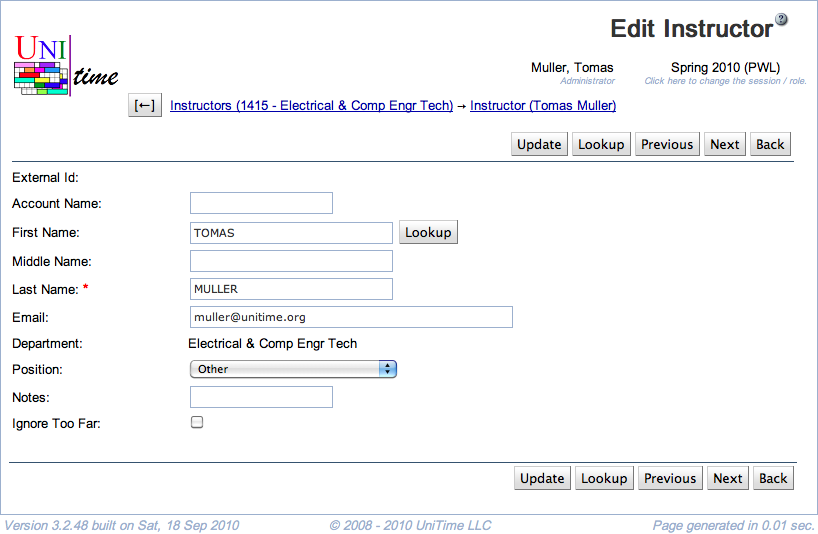

## Screen Description

Edit information about an instructor in this Edit Instructor screen.

{:class='screenshot'}

## Details

* **External Id**
	* Id that identifies this instructor throughout UniTime
	* If possible, matches the university's employee Id
	* Cannot be changed by the user (unless an administrator adds a new setting with name "tmtbl.instructor.allowExternalIdEdit" and value "true" to make external id editable)
	* Can be looked up by clicking on the Lookup button (see description in Operations) if you enter the last name or the account name for the instructor

* **Account Name**
	* If you know the university account name of a new instructor, you can look the person up by this account

* **First Name**
	* First name of the instructor
	* The **Lookup** button next to the first name takes you to the People Lookup screen, pre-populated with the instructor's name; this lookup operates over all tables in UniTime (such as instructors, managers, ...), as opposed to the Lookup in the top/bottom row of buttons

* **Middle Name**

* **Last Name**
	* The only mandatory field in this screen

* **Email**
	* Instructor's email address

* **Department**
	* Shows the department selected in the [Instructors](instructors) screen

* **Position**
	* Position classification of this instructor
	* Note: This field is user maintained and is not required elsewhere in UniTime; it may be useful, however, for grouping instructors or in exports for departmental report

* **Notes**
	* For your use only

* **Ignore Too Far**
	* By default (when unchecked), the solver prohibits placement of back to back classes taught by the same instructor in rooms that are more than a short distance apart
	* If checked, the solver will strongly discourage but not prohibit long distances between back to back classes of this instructor
		* Use with caution!
		* When your timetable is created, make sure you check whether the instructor for whom you chose to ignore too far distances has a feasible timetable (that the instructor can in fact teach the classes that are back to back)

## Operations

* **Update** (Alt+U)
	* Save changes and return to the [Instructor Detail](instructor-detail) screen

* **Delete** (Alt+D)
	* Delete this instructor from the list of instructors
		* Takes you back to the [Instructors](instructors) screen
		* Note: The button is displayed only when there is no class or examination associated with this instructor

* **Lookup** (Alt+L)
	* Look up this instructor's External Id (and other related information) in the imported staff tables
		* Takes you to the screen with the same name (Edit Instructor) which has the search results in it
			* First, you will see a list of matches by the university account (if you filled in the account name)
			* The second part are matches by last name regardless of department (if the instructor teaches for more than one department, you can see the same name with the same External Id displayed several times)
			* Click on the radio button in front of the correct person and click **Select Instructor** if you found the right match (that will populate the External Id of this instructor)
			* Click **Cancel** if you want to return to the previous screen without selecting anybody
		* Message "No matching records found" will appear in the Edit Instructor screen if there is no record matching the instructor's name or the account name that you entered

* **Previous** (Alt+P)
	* Save changes and go to the Edit Instructor screen for the previous instructor in your list of instructors

* **Next** (Alt+N)
	* Save changes and go to the Edit Instructor screen for the next instructor in your list of instructors

* **Back** (Alt+B)
	* Return to the [Instructor Detail](instructor-detail) screen without saving any changes
