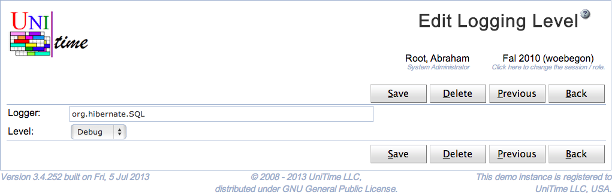

## Screen Description

The Edit Logging Level page can be used to change a logging level. This effects what messages will be printed in the log. The page requires Application Config permission. See [Logging Levels](logging-levels) for more details.

{:class='screenshot'}

## Details

UniTime is using [log4j](http://logging.apache.org/log4j/1.2/) for logging. Each class writing messages into the log is using a separate **logger**, typically named after the class. The loggers form a tree in a similar manner as the classes do. A logging level can be changed for a particular class (logger) or for all classes (loggers) of a given package. For instance, all org.hibernate.cfg classes have the logging level set to Warning, meaning that only warnings or higher messages (errors, fatals) appear in the log. The following logging levels are available:

* All (all messages are logged)

* Trace

* Debug

* Info

* Warning

* Error

* Fatal

* Off (no messages are logged)

If a logging level is set to a particular level, only messages of the level or higher are printed in the log.

The buttons **Previous** and **Next** can be used to save the current role and get to the Edit Logging Level page for the previous / next role.

## Notes

The new logging level will also appear on the [Application Configuration](application-configuration) page, with the log4j.logger. prefix. However, only changing the logging levels through the [Logging Levels](logging-levels) pages will have the immediate effect on the logging.

{:class='screenshot'}

The logger of the default logging levels cannot be changed or deleted, only the level can be changed.

{:class='screenshot'}

## Operations

Click **Save** to update the modified role. Button **Back** will get you back to [Logging Levels](logging-levels) page without making any changes. Click **Delete** to delete the role.

