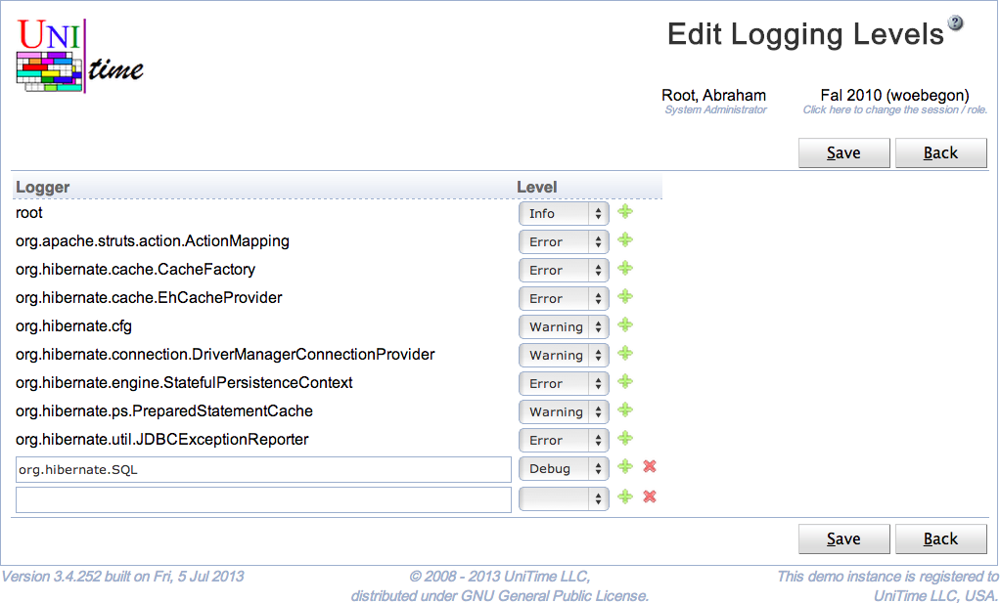
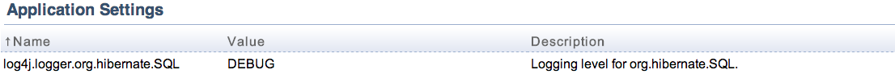

## Screen Description

 The Edit Logging Levels page can be used to modify logging levels. This effects what messages will be printed in the log. The page requires Application Config permission. See [Logging Levels](logging-levels) for more details.

## Details

 UniTime is using [log4j](http://logging.apache.org/log4j/1.2/) for logging. Each class writing messages into the log is using a separate **logger**, typically named after the class. The loggers form a tree in a similar manner as the classes do. A logging level can be changed for a particular class (logger) or for all classes (loggers) of a given package. For instance, all org.hibernate.cfg classes have the logging level set to Warning, meaning that only warnings or higher messages (errors, fatals) appear in the log. The following logging levels are available:

* All (all messages are logged)

* Trace

* Debug

* Info

* Warning

* Error

* Fatal
	* Off (no messages are logged)

 If a logging level is set to a particular level, only messages of the level or higher are printed in the log.

 The logger of the default logging levels cannot be changed or deleted, only the level can be changed.

## Operations

 Click **Save** to save the logging levels. The button **Back** will get you back to [Logging Levels](logging-levels) page without making any changes. A new line can be added by clicking on the green plus button, a line (and the appropriate logging level) can be deleted by clicking the red x button.

 Please note that the logging levels that cannot be deleted do not have the red x button.

## Notes

 The new logging level will also appear on the [Application Configuration](application-configuration) page, with the log4j.logger. prefix. However, only changing the logging levels through the [Logging Levels](logging-levels) pages will have the immediate effect on the logging.

{:class='screenshot'}

{:class='screenshot'}
