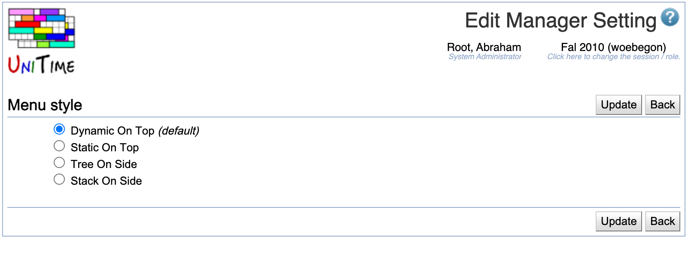

## Screen Description

In the Edit Manager Setting screen, the schedule managers can change a setting value and that way change the appearance of certain part of the application.

{:class='screenshot'}

For a list of settings and their possible values (together with brief explanation for some of them), please see the description of the [Manager Settings](manager-settings) screen.

## Details

The name of the setting appears on the first line. Click the radio box in front of the value of your choice and click **Update** to change the setting value for your profile.

## Operations

* **Update**
	* Save changes and go back to the [Manager Settings](manager-settings) screen

* **Back**
	* Go back to the [Manager Settings](manager-settings) screen without saving changes
