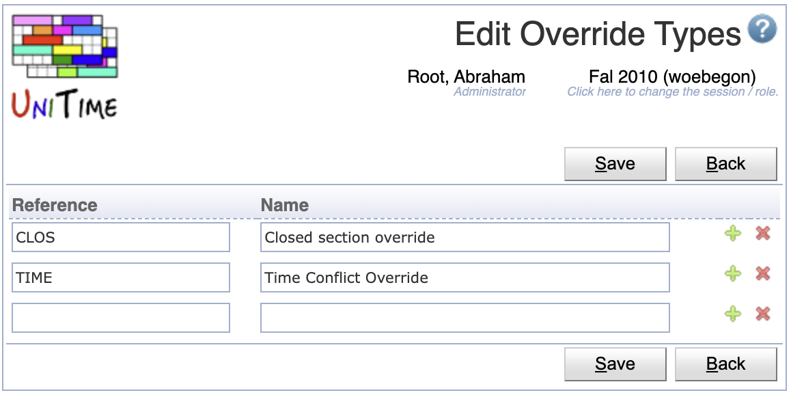

## Screen Description

The Edit Override Types page allows to define the types of overrides that can be enabled or disabled on the [Course Offering Edit](edit-course-offering) page.  This functionality is used when UniTime is integrated with a Student Information System that allows the students to request overrides for rejected enrollment requests.

{:class='screenshot'}

## Details

* **Reference**
	* The code used by the Student Information System to apply the override type

* **Name**
	* A description of the override type

## Operations

* **Save**
	* Save the new override type and go back to the [Override Types](override-types) screen

* **Back**

* Go back to the [Override Types](override-types) screen without saving this new override type

