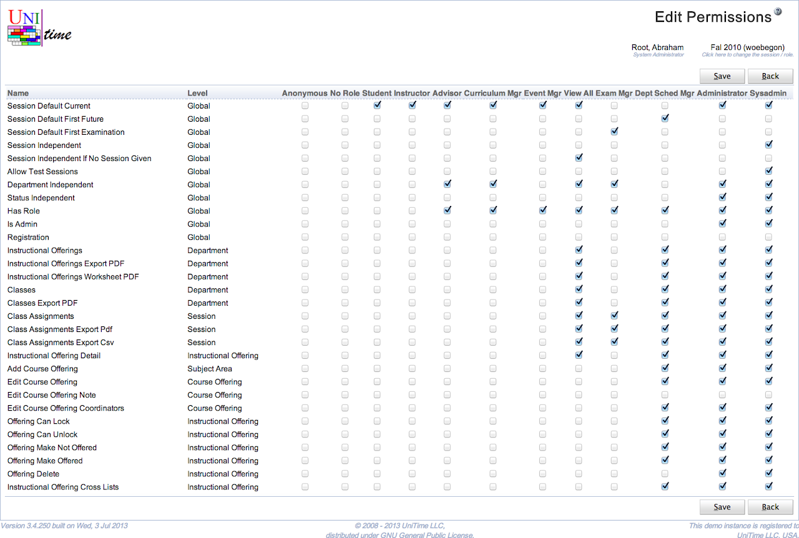

## Screen Description

The Edit Permissions screen makes it possible to edit permissions for various roles all at once.

{:class='screenshot'}

## Details

The table has roles on top, permissions on the left. Check a checkbox to grant the permission from that line to the role in that column. Uncheck a checkbox to withdraw the permission on that line from the role in that column.

## Operations

* **Save**
	* Save changes and go back to the [Permissions](permissions) screen

* **Back**
	* Go back to the [Permissions](permissions) screen without saving any changes

