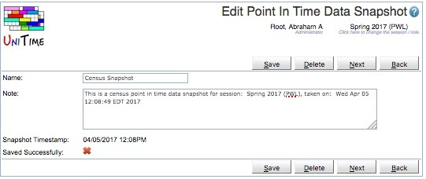

## Screen Description

 The Edit Point In Time Data Snapshot page can be used to update the information about a Point In Time Data snapshot.  It can also be used to delete snapshots.

## Details

 **Name:** The name of the Point In Time Data Snapshot that is displayed in drop down menus.  UniTime creates a default name for each snapshot in the XML when it is exported.  It is expected this page will be used to update the name to something more meaningful.

 **Note:**  A note providing more information about the Point In Time Data Snapshot.  UniTime creates a default note for each snapshot in the XML when it is exported.  It is expected this page will be used to update the note to be more descriptive.

 **Snapshot Timestamp:** The date and time the snapshot was taken.  UniTime sets this date in the xml file when the snapshot is exported.  The snapshot timestamp is not editable.

 **Saved Successfully:**  Indicates whether or not the XML import of the Point In Time Data Snapshot completed successfully.  If an import of a Point In Time Data Snapshot is not successful, the data is corrupt and the snapshot should be deleted.

## Operations

 Click **Save** to update the modified snapshot. Button **Back** will get you back to the [Point In Time Data Snapshots](point-in-time-data-snapshots) page without making any changes. Click **Delete** to delete the snapshot.

 The buttons **Previous** and **Next** can be used to save the current snapshot and get to the Edit Point In Time Data Snapshot page for the previous / next snapshot.

## Notes

 Once the import of a Point In Time Data Snapshot has completed if the snapshot has not been "Saved Successfully" it should be deleted.  The data is corrupt and will not produce accurate reports.

{:class='screenshot'}
