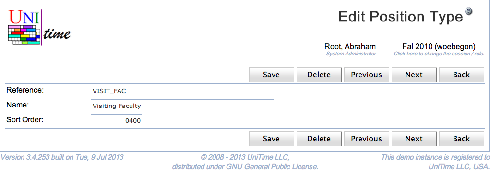

## Screen Description

The Edit Position Type page can be used to edit or delete an existing position type. Each instructor can have a position type defined. The user needs Position Type Edit permission to be able to edit position types. See [Position Types](position-types) page for more details.

{:class='screenshot'}

## Details

Each position type has a reference, a name, and a number that is used for ordering position types. All fields are required and must be unique.

Only position types that are not being used can be deleted.

## Operations

Click **Save** to update the modified position type. Button **Back** will get you back to [Position Types](position-types) page without making any changes. Click **Delete** to delete the position type.

The buttons **Previous** and **Next** can be used to save the current position type and get to the Edit Position Type page for the previous / next position type.
