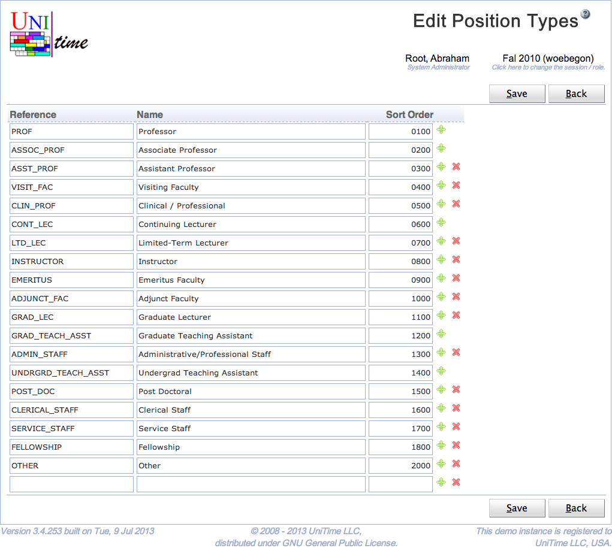

## Screen Description

The Edit Position Types page can be used to create, modify, or delete existing position types using a single page. Each instructor can have a position type defined. The user needs Position Type Edit permission to be able to edit position types. See [Position Types](http://help34.unitime.org/Position_Types) page for more details.

{:class='screenshot'}

## Details

Each position type has a reference, a name, and a number that is used for ordering position types. All fields are required and must be unique.

Only position types that are not being used can be deleted.

## Operations

Click **Save** to save the position types. The button **Back** will get you back to [Position Types](position-types) page without making any changes. A new line can be added by clicking on the green plus button, a line (and the appropriate position type) can be deleted by clicking the red x button.

Please note that the position types that cannot be deleted do not have the red x button.
