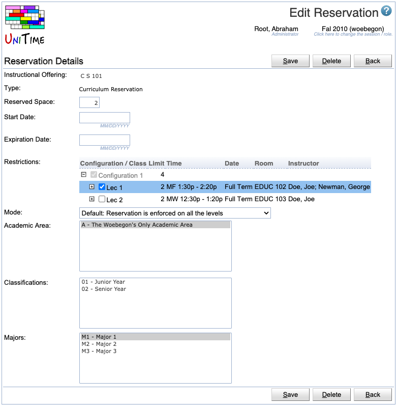

## Screen Description

The Edit Reservation screen allows the user to edit an existing reservation.

{:class='screenshot'}

## Details

* **Instructional Offering**
	* Instructional offering on which the reservation should be made
	* Not editable in this screen

* **Type**
	* Reservation type, only editable on [Add Reservation](add-reservation) page
	* The reservation type defines how the students matching the reservation will be identified
        * It may also define additional properties of the reservation
    * One of the following types:
        * **Individual Reservation**
            * A direct reservation for one or more students
            * Individual reservations allow students to go over the limits and must be followed by the student(s)
        * **Student Group Reservation**
            * A reservation for students of a particular student group
            * Student group reservations must be followed by the student(s) of the selected group
        * **Curriculum Reservation**
            * A reservation for students of a particular curriculum, or identified by the selected academic area(s), classification(s), major(s), and/or minor(s)
        * **Course Reservation**
            * For cross-listed offerings, students registering for the course under the selected course name
        * **Learning Community Reservation**
            * Similar to student group reservations, but allows students to enroll in classes that are disabled, if they are listed in the restrictions of the reservation
        * **Override: Allow Time Conflict**
            * A direct override for one or more students
            * Do not reserve any space, but students of the reservations are permitted to have a time conflict
        * **Override: Can Assign Over Limit**
            * A direct override for one or more students
            * Do not reserve any space, but students of the reservations are permitted to enroll over the limits
        * **Override: Allow Link Conflict (Co-requisite)**
            * A direct override for one or more students
            * Do not reserve any space, but students of the reservations are permitted to violate the Linked Classes distribution
                * *Classes (of different courses) are to be attended by the same students. For instance, if class A1 (of a course A) and class B1 (of a course B) are linked, a student requesting both courses must attend A1 if and only if he also attends B1.*
        * **Individual Override**
            * A direct reservation for one or more students
            * Similar to Individual Reservation, but allows configuring the **Override Properties**
        * **Student Group Override**
            * A reservation for students of a particular student group
            * Similar to Student Group Reservation, but allows configuring the **Override Properties**
        * **Curriculum Override**
            * A reservation for students of a particular curriculum, or identified by the selected academic area(s), classification(s), major(s), and/or minor(s)
            * Similar to Curriculum Reservation, but allows configuring the **Override Properties**
        * **Student Filter**
            * The most general type of the reservation
            * Students are identified by a filter (the same as on the [Online Student Scheduling Dashboard](online-student-scheduling-dashboard))
            * Allows configuring the **Override Properties**

* **Reserved Space**
    * Number of spaces that should be reserved through this reservation
        * Leave blank for unlimited reservations
    * Not editable for individual and course reservations / overrides
        * Calculated automatically for Individual reservations (= how many students are in the list of students)
        * Depends on the course limit in Course reservations as defined on the [Instructional Offering Cross Lists](instructional-offering-cross-lists) page
    * There is a gray text in italics under the text box indicating limits on the number of reserved spaces that arise from the restrictions
        * This text is displayed only if the reserved space is greater than the space available in the course

* **Override Properties**
    * Only available for Individual Override, Student Group Override, Curriculum Override, and Student Filter reservations
    * **Allow Time Conflict** allows matching students to have a time conflict with another course (overlapping time is minimized by the solver)
    * **Can Assign Over Limit** allows matching students to get into the course over the course, configuration, and class limits
    * **Student Must Follow** matching students must follow this reservation/override (or some other matching reservation if also must be followed)
    * **Do Not Reserve Space** do not reserve space for the student(s) of this reservation (effectively making the reservation always expired)

* **Start Date**
    * Date upon which the reservation starts, i.e., it will start reserving the space
    * If no start date is set, the reservation is active until it expires (or it is always active when both dates are blank)
    * Start Date cannot be selected for overrides (they do not reserve any space for the students of this reservation)

* **Expiration Date**
    * Date upon which the reservation expires, i.e., the reserved spaces are made available for other students
    * Click on the calendar icon next to the text field to be able to pick a date from the calendar
    * If no expiration date is set, the reservation does not expire
    * Expiration Date cannot be selected for overrides (they do not reserve any space for the students of this reservation)

* **Restrictions**
    * Restrictions within the instructional offering regarding which part(s) of the instructional offering the reservation is set on
        * Click on the plus sign in front of a configuration to unfold its structure; you may need to click more plus signs to unfold it further

* **Mode**
    * *Reservation: Reservation is enforced on all levels*
        * When used, the space is reserved on all the levels (the space must be available on the course, in the configuration, and in all the classes that meet the restrictions)
        * This is the default mode
    * *Restriction: Reservation is only enforced on the selected*
        * When used, the space is reserved only on configurations and/or classes that are selected in the Restrictions (have the blue checkbox)
        * When there are no restrictions, the space is reserved only on the course level

* The following parameters are based on the **Type** of reservation selected
    * **Students**
        * Individual Reservation, Override:XX, Individual Override types
        * An individual reservation will be created for each of the students in the list
            * Click on the **Lookup** button to look up students in the Students table in the database through the [People Lookup](people-lookup) screen
            * You can also copy/paste a list of External IDs into the list of students (instead of looking them up individually)
    * **Student Group**
        * Student Group Reservation, Learning Community Reservation, or Student Group Override types
        * Student group for which the reservation should be made
        * Student groups can be set up through Administration &rarr; [Student Groups](student-groups)
    * **Curriculum**
        * Curriculum Reservation or Curriculum Override types
        * It is possible to import Curricula via an XML or enter/edit them manually in Courses &rarr; [Curricula](curricula)
        * It is also possible to enter a curriculum reservation without setting up curricula in UniTime - only select academic area, classification & major(s)
        
        * **Academic Area**
            * Academic area for which the reservation should be made
            * One or more academic areas can be selected
        * **Classifications**
            * Year(s) or semester(s) of study
        * **Majors**
            * One or more majors within the selected academic area
        * **Concentrations**
            * If one or more concentrations are defined for a major
        * **Minors**
            * If one or more minors are defined for an academic area
    * **Course**
        * Course Reservation type
        * A course within the instructional offering for which the reservation should be made
        * Helpful for cross-listed courses
    * **Student Filter**
        * Student Filter type
        * Students are identified by a filter (the same as on the [Online Student Scheduling Dashboard](online-student-scheduling-dashboard))
        * Allows for boolean expressions, such as: *(Students in PreReg group that are not of major M1)*
            * group:PreReg and not major:M1

## Operations

* **Save**
	* Save the new reservation and go back to the previous screen

* **Delete**
	* Delete this reservation and go back to the previous screen

* **Back**
	* Go back to the previous screen without saving any changes

## Notes

There is a difference between setting an expiration date on a reservation and deleting a reservation. When a reservation is deleted, UniTime does not know about it any more. When a reservation has expired, UniTime knows about it and still sections/schedules the students into their correct sections; only the not yet occupied seats are available for any other students. This is useful for example when students have individual reservations and allow overlaps of their classes. If such an individual reservation is deleted (instead of "just" expired), there is a conflict between overlapping classes and it is not possible for that student to be scheduled into both of them.
