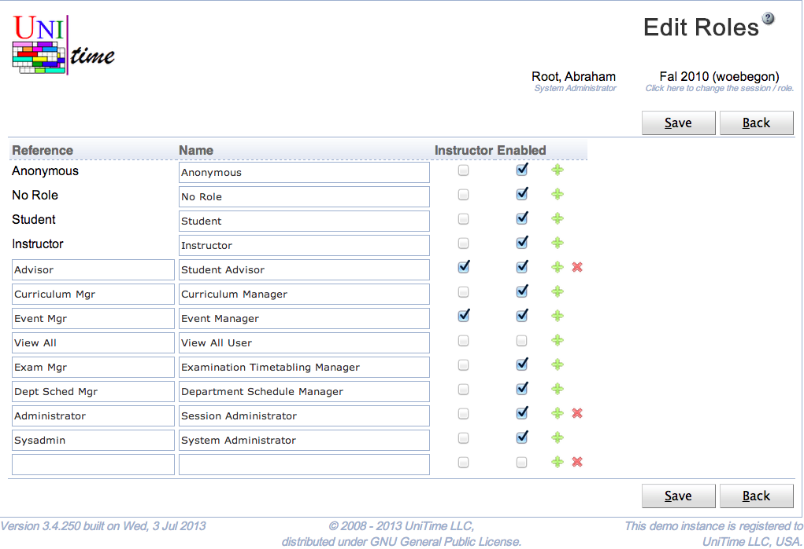

## Screen Description

 The Edit Roles page can be used to create, modify, or delete existing roles using a single page. These roles can be assigned to UniTime managers ([Timetable Managers](timetable-managers) page) or instructors ([Instructor Roles](instructor-roles) page). Permissions of a role can be defined on the [Permissions](permissions) page. See [Roles](roles) page for more details.

 The user needs to have Role Edit permission to be able to edit roles. A role can be only deleted if there is no instructor or manager using the role. The four basic roles (anonymous, no role, student, and instructor) cannot be deleted.

## Details

 A role has a reference and a name. When Instructor toggle is checked, the role can be assigned to an instructor (or any departmental personell) using the Instructor Roles page. When the toggle is unchecked, the role can be only used on the [Timetable Managers](timetable-managers) page. Roles that are not enabled can be assigned to managers (or instructors), but they will not get assigned to the authenticated users.

## Operations

 Click **Save** to save the roles. The button **Back** will get you back to [Roles](roles) page without making any changes. A new line can be added by clicking on the green plus button, a line (and the appropriate role) can be deleted by clicking the red x button.

 Please note that the roles that cannot be deleted do not have the red x button.

{:class='screenshot'}
