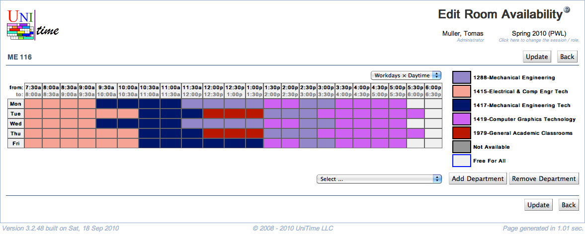

## Screen Description

The Edit Room Availability screen allows the department which controls the room to set up room sharing with other departments and the availability of the room at particular times.

{:class='screenshot'}

## Details

In the drop down menu right under the room name (above the time grid), you can select what times you want to see in the time grid.

The main part of this screen is the time grid in which you can specify the room availability for different departments as follows:

* Click on the colored rectangle next to the department to which you want to assign a particular time/times; then click on the times in the time grid (they will be filled with the color when you do)
	* Hint: to select the whole day, click on the name of the day; to select a particular time across all days, click on that time; to select the whole time grid, click on the "from: to:" in the upper left hand side corner of the grid

* You can also mark certain times as not available for any department (click on the gray rectangle next to "Not Available" in the legend and then click on those particular squares in the time grid)

* Note: all the times that are left as "Free For All" are available to all the departments listed next to the time grid; the department which commits their timetable first will have the room at the times they pick

To add a department to the list of departments that can share the room, select that department from the drop down list under the time grid and click **Add Department** (Alt+A).

To remove a department from the list of departments that can share the room, select that department from the drop down list under the time grid and click **Remove Department** (Alt+R).

## Operations

* **Update** (Alt+U)
	* Save changes and go back to the [Room Detail](room-detail) screen

* **Back** (Alt+B)
	* Go back to the [Room Detail](room-detail) screen without saving any changes
