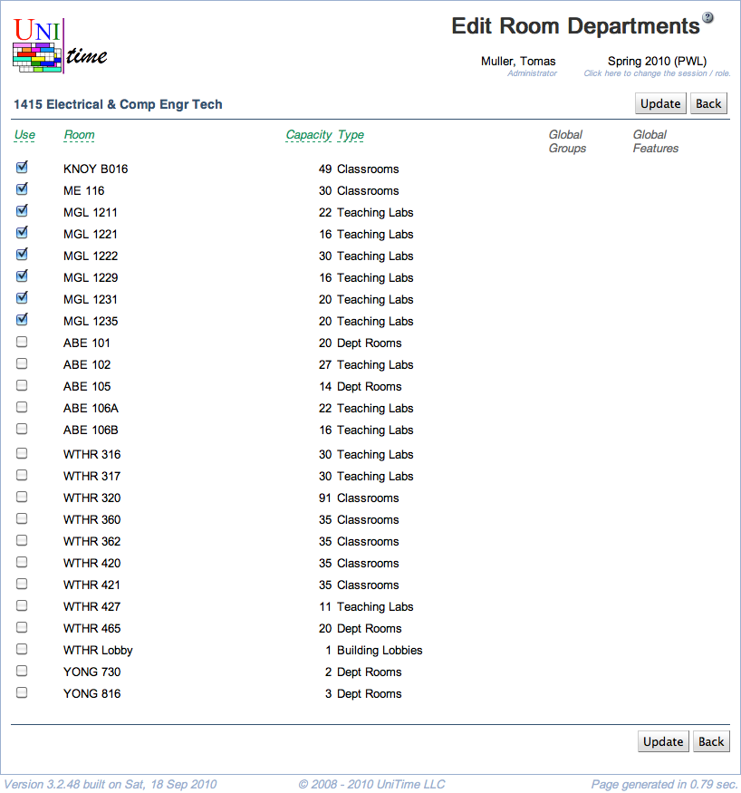

## Screen Description

In the Edit Room Departments screen, you can indicate which rooms from all rooms available to you can be used by the department selected in the [Rooms](rooms) screen. This screen is useful for deputies who manage more than one department.

{:class='screenshot'}

## Details

The first column - **Use** - contains a checkbox for each room. When checked, the room on that line will be assigned to the department listed on the top line of the screen, if unchecked, the room will not be available to the department.

See the description of the [Rooms](rooms) screen for interpretation of other columns.

The table can be sorted by any column that shows "Order by this column." when you roll the mouse over. Click on such column header to sort by that column.

## Operations

* **Update** (Alt+U)
	* Save changes and go back to the [Rooms](rooms) screen

* **Back** (Alt+B)
	* Go back to the [Rooms](rooms) screen without saving changes
