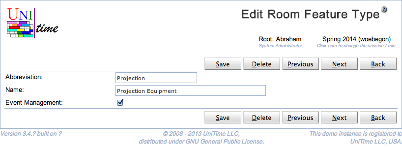

## Screen Description

The Add and Edit Room Feature Type pages can be used to change an existing room feature type, add it, or delete it. Room feature types are used to categorize room features (each room feature can have a room feature type defined, e.g., seating arrangement, black board size). See [Room Feature Types](room-feature-types) for more detail.

{:class='screenshot'}

The user needs to have Room Feature Type Edit permission to be able to edit room feature types. A room feature type can be only deleted when there are no room features of that type.

## Details

Room feature type has an abbreviation and a name. Both fields are required and need to be unique within the list of existing room feature types. The Event Management can be used to hide some of the less useful features from event management. Such room features will not show up in the [Room Filter](events-room-filter) component (e.g., on the [Events](events) page).

## Operations

Click **Save** to update the modified room feature type. Button **Back** will get you back to [Room Feature Types](room-feature-types) page without making any changes. Click **Delete** to delete the room feature type.

If there are multiple room feature types, the buttons **Previous** and **Next** can be used to save the current type and get to the Edit Room Feature Type page for the previous / next type.
