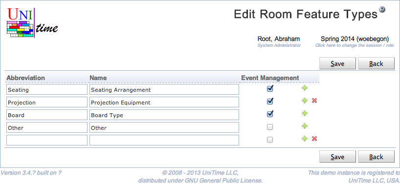

## Screen Description

The Edit Room Feature Types page can be used to create, modify, or delete existing room feature types using a single page. Room feature types are used to categorize room features (each room feature can have a room feature type defined, e.g., seating arrangement, black board size). See [Room Feature Types](room-feature-types) for more detail.

{:class='screenshot'}

The user needs to have Room Feature Type Edit permission to be able to edit room feature types. A room feature type can be only deleted when there are no room features of that type.

## Details

Room feature type has an abbreviation and a name. Both fields are required and need to be unique within the list of existing room feature types. The Event Management can be used to hide some of the less useful features from event management. Such room features will not show up in the [Room Filter](events-room-filter) component (e.g., on the [Events](events) page).

## Operations

Click **Save** to save the room feature types. The button **Back** will get you back to [Room Feature Types](room-feature-types) page without making any changes. A new line can be added by clicking on the green plus button, a line (and the appropriate room feature type) can be deleted by clicking the red x button.

Please note that the room feature types that cannot be deleted do not have the red x button.
