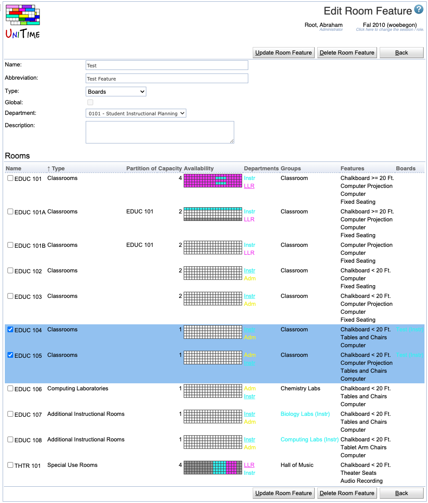

## Screen Description

In the Edit Room Feature screen, you can change the feature's properties that you entered in the [Add Room Feature](add-room-feature) screen and you can indicate which rooms have this feature.

{:class='screenshot'}

## Details

The first part of the screen is the same as the [Add Room Feature](add-room-feature) screen:

* **Abbreviation**
	* Abbreviation that will be displayed in the [Rooms](rooms) screen

* **Name**
	* Room feature name

* **Type** 
	* Room feature type
	* The field only appears if there are some room feature types defined on the [Room Feature Types](room-feature-types) administration page.
	* Room feature types can be used to categorize room features (seating arrangement, black board size, etc.). It defaults to No Type (no room feature type selected).

* **Global** (admin)
	* The administrator can decide whether this feature is global or not

* **Department**
	* Indicates which department wants to work with this feature

* **Description**
	* Optional description of the room feature

* **Rooms**
	* The list of rooms (following the **Filter** from the [Room Features](room-features) screen page)
	* Check the rooms that have the feature
		* Checking a room will add it to the feature, unchecking will remove the feature from the room

## Operations

* **Update Room Feature**
	* Save changes and go back to the [Room Features](room-features) screen

* **Delete Room Feature**
	* Delete this room feature and go back to the [Room Features](room-features) screen

* **Back**
	* Go back to the [Room Features](room-features) screen without saving any changes
