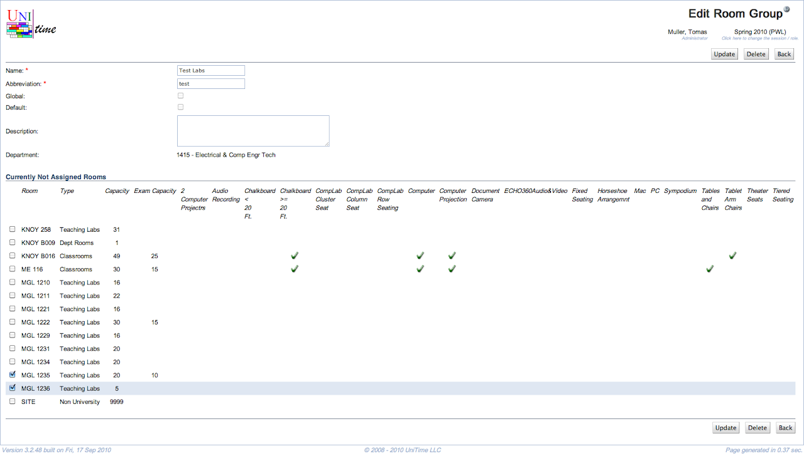

## Screen Description

In the Edit Room Group screen, you can change the room group's properties that you entered in the [Add Room Group](add-room-group) screen and you can indicate which rooms belong to this group.

{:class='screenshot'}

## Details

The first part of the screen is the same as the [Add Room Group](add-room-group) screen:

* **Name**
	* A name that is helpful to you

* **Abbreviation**
	* Abbreviation that will be displayed in the [Rooms](rooms) screen

* **Default** (admin)
	* The administrator can decide whether this room group is default or not
	* Only global rooms can be default
	* A default room group is automatically required for all newly created scheduling subparts (e.g., Required Classroom)

* **Global** (admin)
	* The administrator can decide whether this room group is global or not

* **Description**
	* The description should help you remember your intentions with this group; you can enter anything that is helpful to you

* **Department**
	* Indicates which department should be able to work with this room group
	* Displayed only for departmental room groups

* **Rooms**
	* The list of rooms (following the **Filter** from the [Room Groups](room-groups) screen page)
	* Check the rooms that belong into this room group
		* Checking a room will add it to the group, unchecking will remove the room from the group

## Operations

* **Update Room Group**
	* Save changes and go back to the [Room Groups](room-groups) screen

* **Delete Room Group**
	* Delete this room group and go back to the [Room Groups](room-groups) screen

* **Back**
	* Go back to the [Room Groups](room-groups) screen without saving any changes
