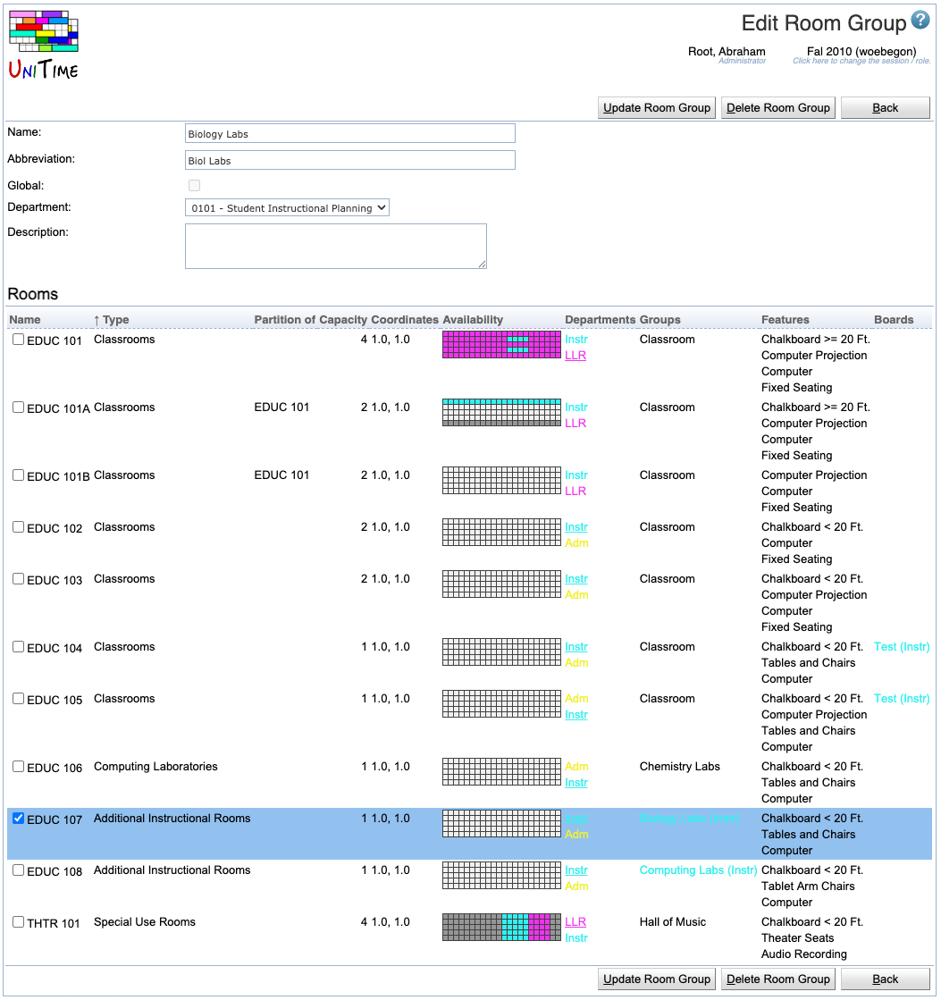

## Screen Description

In the Add and Edit Room Group screens, the user can add or change the room group's properties.

{:class='screenshot'}

## Details

The first part of the screen is the same as the [Add Room Group](add-room-group) screen:

* **Name**
	* A name that is helpful to you

* **Abbreviation**
	* Abbreviation that will be displayed in the [Rooms](rooms) screen

* **Global** (admin)
	* The administrator can decide whether this room group is global or not

* **Description**
	* The description should help you remember your intentions with this group; you can enter anything that is helpful to you

* **Department**
	* Indicates which department should be able to work with this room group
	* Displayed only for departmental room groups

The list of rooms assigned to a given department follows. It is divided into two parts:

* **Currently Assigned Rooms**
	* The rooms that belong to this room group
	* Uncheck the checkbox for a given room to indicate the room does not belong to this group

* **Currently Not Assigned Rooms**
	* Rooms that do not belong to this room group
	* Check the checkbox for a given room to indicate that the room should be a part of this group

## Operations

* **Update/Save** (Alt+U/Alt+S)
	* Save changes and go back to the [Room Groups](room-groups) screen

* **Delete** (Alt+D)
	* Delete this room group and go back to the [Room Groups](room-groups) screen

* **Back** (Alt+B)
	* Go back to the [Room Groups](room-groups) screen without saving any changes
