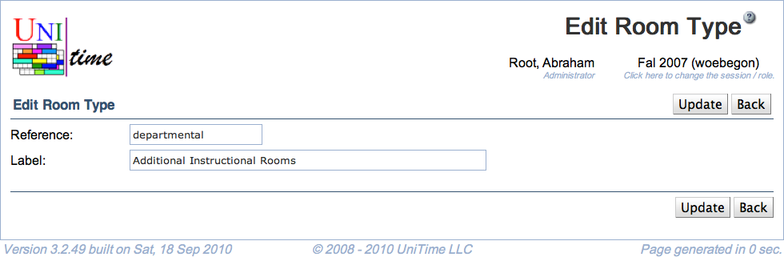

## Screen Description

The Edit Room Type screen provides interface for editing an existing room type.

{:class='screenshot'}

## Details

* **Reference**
	* Name under which the room type is recognized internally by the application
	* Should be implemented if the room type is to be used
		* It is used in XML import of buildings and rooms (scheduledRoomType attribute)

* **Label**
	* Name of the room type that is displayed in other screens throughout the application (for example, in the [Add Event](add-event) screen)

## Operations

* **Update** (Alt+U)
	* Save changes to the room type and go back to the [Room Types](room-types) screen

* **Delete** (Alt+D)
	* Delete the room type and go back to the [Room Types](room-types) screen
		* It is only possible to delete a room type that has no room associated with it

* **Back** (Alt+B)
	* Go back to the [Room Types](room-types) screen without saving changes to the room type

