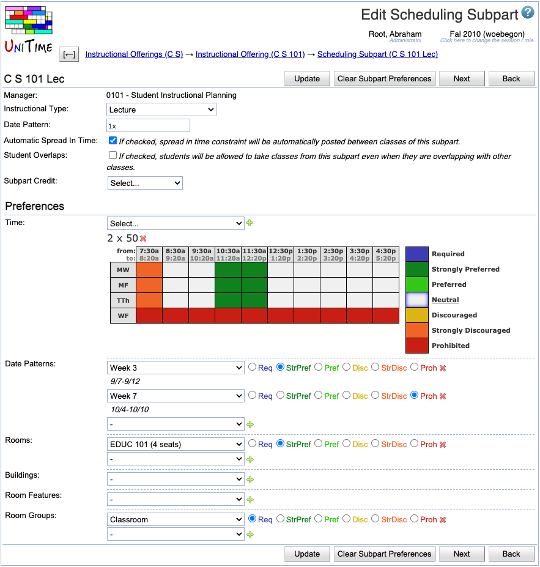

## Screen Description

 In the Scheduling Subpart Edit screen, you can change a few properties of the scheduling subpart and enter preferences which will then be applied to the classes of the scheduling subpart. The rules explaining how preferences are applied on classes are located in [Application Of Preferences](application-of-preferences). Changes made to this screen are not saved until you click on the Update, Previous, or Next button.

## Details

* **Manager**
	* Manager responsible for timetabling the classes of this scheduling subpart
	* Editable in the [Multiple Class Setup](multiple-class-setup) screen

* **Instructional Type**
	* To change the instructional type, select the new type from the drop down list

* **Date Pattern**
	* To change the date pattern, select the new date pattern from the drop down list
	* You can click on the icon of the calendar to see which dates belong to the selected date pattern

* **Automatic Spread In Time**
	* Checked by default, which means that when the classes of this subpart are timetabled, the solver will attempt to spread the different classes in time, so that students have more options (Spread in Time constraint is automatically created between all the classes of the subpart).
	* Uncheck only if you need the classes to follow a different pattern, e.g., when you need some classes to be at the same time (unchecking this checkbox will prevent the solver from applying the Spread in Time constraint between these classes)

* **Student Overlaps**
	* Not checked by default
	* If checked, students will be allowed to take classes from this subpart even when they are overlapping with other classes

* **Subpart Credit**
	* Credit that is attributable to this subpart
	* Described in the screen documentation for the [Edit Course Offering](edit-course-offering) screen

## Preferences

 **Time Preferences**

* If you don't see any time grid, you need to select a time pattern from the drop down list and click **Add Time Preference** (Alt+T)

* You can have more than one possible time pattern for your classes - in that case, perform the previous step again to add another time grid

* Indicate the time preferences by filling in the time slots with appropriate colors (click on the colored square in the legend and then on the squares in the time grid that you want to fill in with this preference level)

* Click on the day of week (or combination of days of week) to fill in the grid for the whole day (or combination of days)

* Click on a particular time to fill in the grid for this time (across all the days)

* Click on the upper left hand side corner (which has "from:" and "to:") to fill in the whole time grid

* To delete a time pattern, click on the **Delete** button next to it

* Note: To express that e.g. the classes of this scheduling subpart can only be taught on Monday, Wednesday, and Friday, fill in Tuesday and Thursday times as "Prohibited" (as opposed to setting Monday, Wednesday, and Friday as "Required"); this leaves you flexibility to indicate preferred or discouraged times within Monday, Wednesday, and Friday

 **Room Group Preferences**

* Select a room group from the first drop down list and the preference level from the second drop down list

* You can see only those room groups that are applicable to classes of the given manager (for example, for LLR classes you can see groups of large lecture rooms); for your departmental classes, you can see only those room groups that are listed in your [Room Groups](room-groups) screen - if you need to add another room group, go to the menu, to Courses → Input Data → [Room Groups](room-groups)

* To add more lines for additional room group preferences, click on **Add Room Group Preference** (Alt+G)

* To delete a line with a room group preference, click on the **Delete** button on that line

* Blank lines are ignored

 **Room Preferences**

* Select a room from the first drop down list and the preference level from the second drop down list

* You can see only those rooms that are listed in the [Rooms](rooms) screen for the department managed by the manager listed in your Edit Scheduling Subpart screen (look at [Rooms](rooms) to see how to add new rooms to your list of departmental rooms)

* To add more lines for additional room preferences, click on **Add Room Preference** (Alt+R)

* To delete a line with a room preference, click on the **Delete** button on that line

* Blank lines are ignored

 **Building Preferences**

* Select a building from the first drop down list and the preference level from the second drop down list

* You can see only those buildings that are listed in your [Rooms](rooms) screen for the department of this scheduling subpart's manager

* To add more lines for additional building preferences, click on **Add Building Preference** (Alt+D)

* To delete a line with a building preference, click on the **Delete** button on that line

* Blank lines are ignored

 **Room Feature Preferences**

* Select a room feature from the first drop down list and the preference level from the second drop down list

* You can see only those room features that are listed in the [Rooms](rooms) screen

* If you need to add another room feature for your departmental rooms, go to the menu, to Courses → Input Data → [Room Features](room-features)

* To add more lines for additional room feature preferences, click on **Add Room Feature Preference** (Alt+F)

* To delete a line with a room feature preference, click on the **Delete** button on that line

* Blank lines are ignored

## Operations

* **Update** (Alt+U)
	* Save changes and go back to the [Scheduling Subpart Detail](scheduling-subpart-detail) screen

* **Clear Subpart Preferences** (Alt+C)
	* Clear all the subpart preferences in this page and go back to the [Scheduling Subpart Detail](scheduling-subpart-detail) screen (where you can see that the preferences have been cleared)

* **Previous** (Alt+P)
	* Save changes and go to the Edit Scheduling Subpart screen for the previous scheduling subpart

* **Next** (Alt+N)
	* Save the preferences and go to the Edit Scheduling Subpart screen for the next scheduling subpart

* **Back** (Alt+B)
	* Go back to the [Scheduling Subpart Detail](scheduling-subpart-detail) screen without saving any changes

## Notes

 **Room Groups vs. Room Features**

 The difference between room groups and room features is as follows:

* If you require more than one room group for a given scheduling subpart, it is sufficient if the assigned room belongs to one of them

* If you require more than one room feature, the assigned room has to have all of them

{:class='screenshot'}
