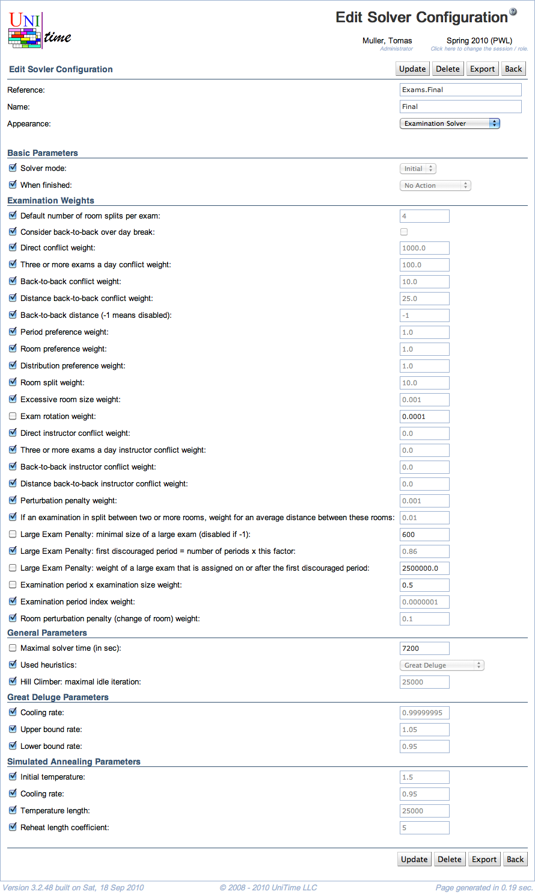

## Screen Description

The Add and Edit Solver Configuration screens provide interfaces for adding a new solver configuration or making changes to an existing configuration.

{:class='screenshot'}

**Note:** Changes to solver parameters can dramatically change the behavior of the solver, therefore it is not recommended to make changes unless you know very well what you are doing.

## Details

The top part of the screen allows to change

* **Reference**
	* Unique name of the configuration

* **Name**
	* Name of the configuration which is displayed in the screens where the configuration is used

* **Appearance**
	* Names of screens in which this configuration appears (can be used)

The rest of the screen contains solver parameters grouped into solver parameter groups. When a checkbox is checked, the default value is being used for the parameter. (To change the default value, uncheck the checkbox in front of the parameter name and then change the value at the end of the line.)

## Operations

* **Update/Save** (Alt+U/Alt+S)
	* Save changes and go back to the [Solver Configurations](solver-configurations) screen

* **Delete** (Alt+D)
	* Delete the configuration

* **Export** (Alt+E)
	* Export the configuration into a text file

* **Back** (Alt+B)
	* Go back to the [Solver Configurations](solver-configurations) screen without saving any changes

