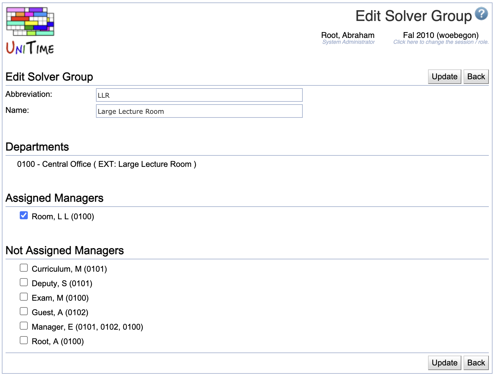

## Screen Description

The Add and Edit Solver Group screens provide interfaces for adding a new solver group or editing an existing solver group.

{:class='screenshot'}

The solver group can include only departments that are not a part of another solver group. It can include any existing managers.

## Details

* **Abbreviation**
	* Solver group abbreviation (displayed e.g. in the [Timetables](timetables) screen)

* **Name**
	* Name of the solver group

* **Assigned Departments**
	* Departments that are currently a part of the solver group
	* A department can be removed by unchecking the checkbox in front of its name (in case a timetable has not been committed)

* **Assigned Managers**
	* Schedule managers who can currently create/save/commit a timetable for this solver group
	* Uncheck the checkbox in front of a manager's name to remove them from the solver group

* **Not Assigned Departments**
	* A list of departments that are not a part of any other solver group (only such departments can be added to a solver group)
	* This section is displayed only if a timetable has not been committed for this solver group
	* Check any departments you want to include

* **Not Assigned Managers**
	* A list of all schedule managers who are not currently included in the solver group
	* Check any schedule managers who should be allowed to create/save/commit timetables for the solver group

## Operations

* **Update**
	* Save changes and go back to the [Solver Groups](solver-groups) screen

* **Delete**
	* Delete this solver group and go back to the [Solver Groups](solver-groups) screen
	* This operation is available only if a timetable has not been committed for the solver group

* **Back**
	* Go back to the [Solver Groups](solver-groups) screen without saving any changes
