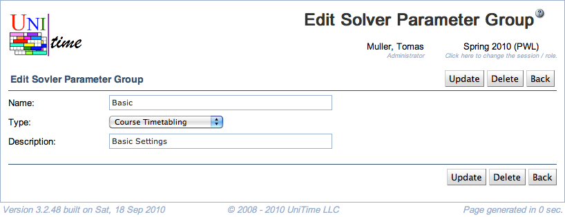

## Screen Description

The Add and Edit Solver Parameter Group screens provide interfaces for adding a new solver parameter group or editing an existing solver parameter group.

{:class='screenshot'}

**Note:** Changes to solver parameters can dramatically change the behavior of the solver, therefore it is not recommended to make changes unless you know very well what you are doing.

## Details

* **Name**
	* Name of the solver parameter group

* **Description**
	* Description of the solver parameter group (should indicate the type of parameters in this group)

## Operations

* **Update/Save** (Alt+U/Alt+S)
	* Save changes and go back to the [Solver Parameter Groups](solver-parameter-groups) screen

* **Delete** (Alt+D)
	* Delete this solver parameter group and go back to the [Solver Parameter Groups](solver-parameter-groups) screen
	* **Note:** Do not delete solver parameter groups

* **Back** (Alt+B)
	* Go back to the [Solver Parameter Groups](solver-parameter-groups) screen without saving any changes
