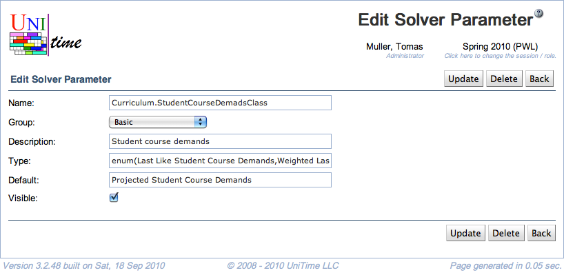

## Screen Description

The Edit Solver Parameter screen provides interface for editing an existing solver parameter. Note, however, that changes of certain kind should be implemented and recognized by the solver before they are made here.

{:class='screenshot'}

## Details

* **Name**
	* Unique name of the parameter
	* The convention is that the first part should reflect the parameter group (for example, solver mode in the Basic group is named Basic.Mode)

* **Group**
	* You can change the group for the parameter

* **Description**
	* Description of the parameter, as displayed e.g. in the [Edit Solver Configuration](edit-solver-configuration) screen

* **Type**
	* Type of the parameter
		* For example, when the type is boolean, the value can be set by checking or unchecking a checkbox

* **Default**
	* The default value of the parameter (can be later changed by administrator in the [Edit Solver Configuration](edit-solver-configuration) or [Add Solver Configuration](add-solver-configuration) screen or, in the Basic group, by any user in the [Solver](solver) screen just before a solver run)

* **Visible**
	* If checked, this parameter is a part of the configuration settings (can be changed in the [Add](add-solver-configuration)/[Edit Solver Configuration](edit-solver-configuration) screens)
	* If unchecked, the default value of the parameter cannot be changed anywhere but in the **Edit Solver Parameter** screen

## Operations

* **Update** (ALT+U)
	* Save changes and go back to the [Solver Parameters](solver-parameters) screen

* **Delete** (ALT+D)
	* Delete the solver parameter and go back to the [Solver Parameters](solver-parameters) screen
	* The solver will continue to recognize this parameter, but there will be no way in the timetabling application to change its default value

* **Back** (ALT+B)
	* Go back to the [Solver Parameters](solver-parameters) screen without saving any changes
