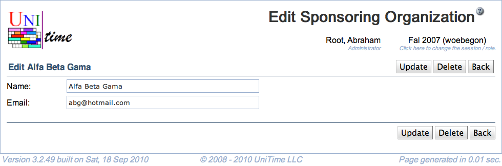

## Screen Description

 Interface for editing an existing sponsoring organization.

## Details

* **Name**
	* Name of the sponsoring organization
	* Mandatory

* **Email**
	* Contact email for the sponsoring organization
	* Not mandatory (but recommended - when an event is changed that is sponsored by an organization that provided an email address, a confirmation email is sent to that address)

## Operations

* **Update** (Alt+U)
	* Update changes made to the sponsoring organization and go back to the [Sponsoring Organizations](sponsoring-organizations) screen

* **Delete** (Alt+D)
	* Delete the sponsoring organization and go to the [Sponsoring Organizations](sponsoring-organizations) screen

* **Back** (Alt+B)
	* Go to the [Sponsoring Organizations](sponsoring-organizations) screen without saving changes to the organization

{:class='screenshot'}
