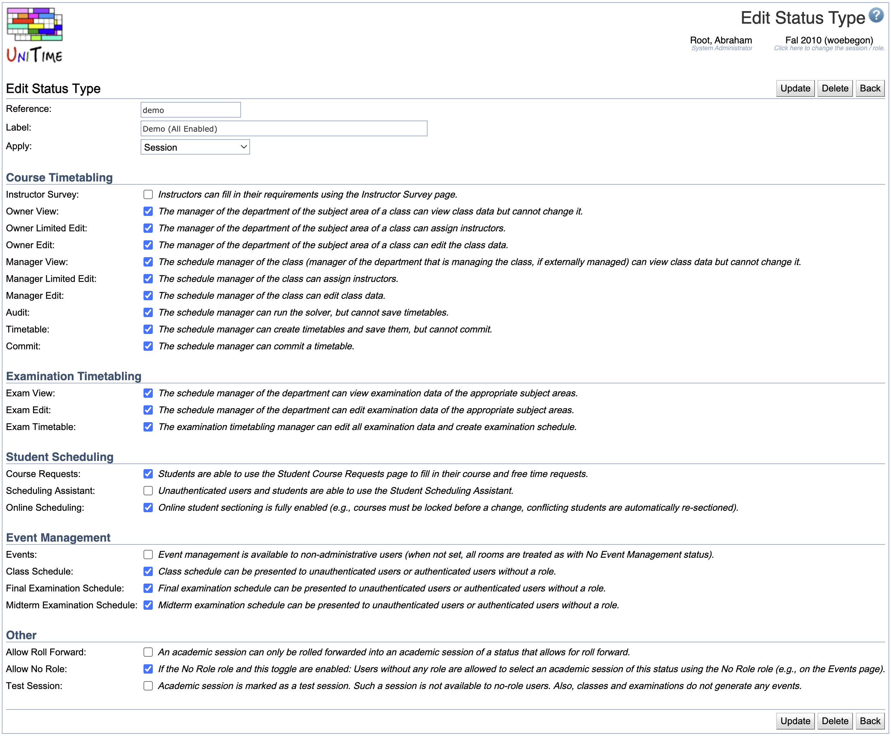

## Screen Description

The Add and Edit Status Type screens provide interfaces for defining rights for an existing and/or new status. The rights are the same as in the [Add Status Type](add-status-type) screen and each of them contains a description.

{:class='screenshot'}

## Details

The items are the same as in the Add Status mode. Any of them can be changed.

## Operations

* **Update**
	* Save changes and go to the [Status Types](status-types) screen

* **Delete**
	* Delete this status type and go back to the [Status Types](status-types) screen

* **Back**
	* Go back to the [Status Types](status-types) screen without saving any changes
