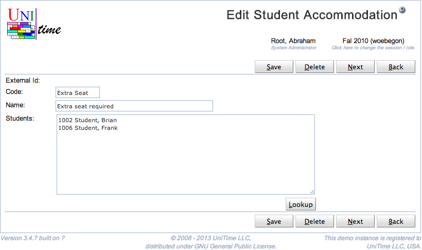

## Screen Description

The Add and Edit Student Accommodation screens provide interfaces for adding a new student accommodation or editing an existing student accommodation. (It is also possible to edit all student accommodations at once in the [Edit Student Accommodations](edit-student-accommodations) screen, accessible from the [Student Accommodations](student-accommodations) screen.)

{:class='screenshot'}

## Details

* **External Id**
	* Not editable in UniTime

* **Code**
	* Code or abbreviation of the accommodation 
	* Used in UniTime to identify the accommodation (displayed in various screens etc.)

* **Name**
	* Name of the accommodation

* **Students**
	* A list of students with this accommodation
	* Editable only for accommodations that have been added through the [Add Student Accommodation](add-student-accommodation) screen in UniTime (not editable for the student accommodations with External Ids)
		* It is possible to use the **Lookup** button to get to the [People Lookup](people-lookup) screen and look the students up one by one or to copy a list of External Ids of the students to the editable text field

## Operations

* **Save**
	* Save changes to the student accommodations and go back to the [Student Accommodations](student-accommodations) screen

* **Back**
	* Go back to the [Student Accommodations](student-accommodations) screen without saving any changes
